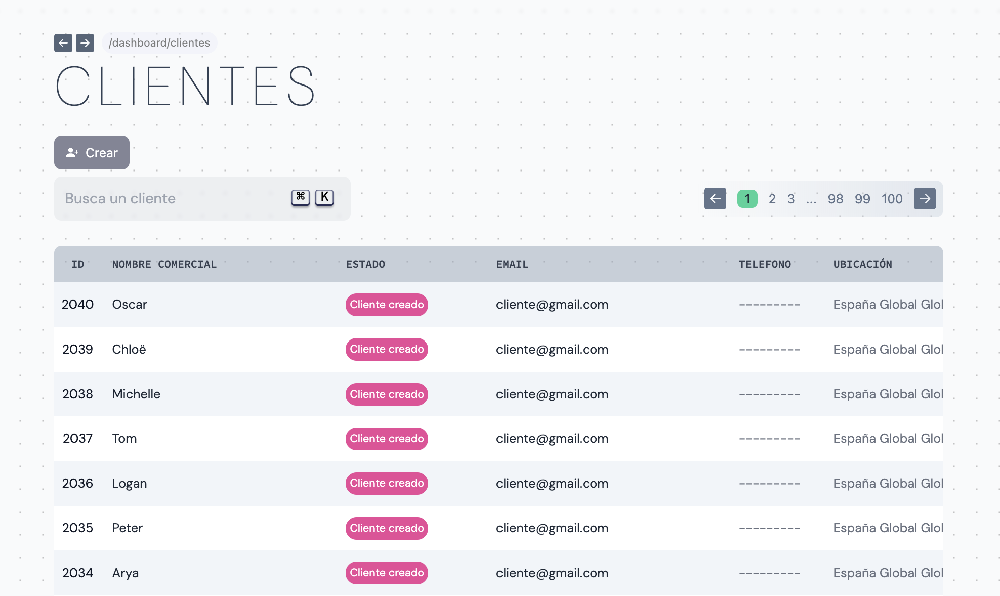
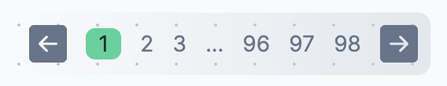

## Listado de clientes

Accede a tu base de datos de clientes, consulta sus datos personales y accede a sus documentos.

## Buscador y paginación

### Buscador

El buscador te permite encontrar clientes filtrados por las siguientes propiedades:

- ID
- Nombre comercial
- Nombre fiscal
- Email
- Teléfono
- Estado

### Paginación

Los clientes se muestran en páginas de 20 clientes. Para cambiar de página haz click en el navegador de la parte superior o inferior de la lista, donde se muestra el número de páginas disponibles. Puedes cambiar de página de la siguiente manera:

- Haz click en la flecha izquierda para retroceder una página.
- Haz click en la flecha derecha para avanzar una página.
- Accede directamente a una página haciendo click en el número.
