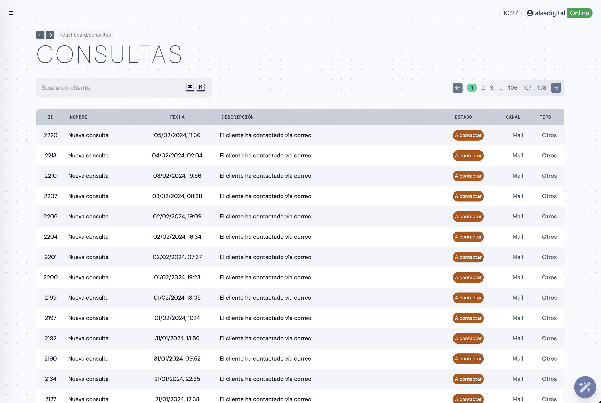

Gestiona las consultas y formularios entrantes. La página de consulta nos muestra el listado de interacciones con el cliente. Podemos dividir esta página en 2 vistas:

- Buscador y paginación
- Listado de consultas

## Buscador y paginación

Al igual que en la sección de clientes, en consultas tenemos un buscador y un navegador de páginas. El buscador nos permite filtrar por las siguientes propiedades de cada consulta:

- ID
- Nombre comercial
- Fecha
- Estado
- Canal
- Tipo

En búsquedas como el estado o la fecha, simplemente escribimos textualmente el nombre del estado o la fecha:
> **Ejemplo**  
> _Búsqueda_ ➡️ "Pendien.."  
> _Resultado_ ➡️ Todas las consultas con estado "Pendiente de respuesta"

En cuanto a la paginación, tanto en la parte superior como inferior del listado, tenemos el selector de páginas, avance y retroceso. Las consultas se agrupan en páginas de 20.

## Listado de consultas

Esta sección nos muestra las consultas en formato lista. Al entrar, las consultas se ordenarán automáticamente por su estado. El orden de estados es el siguiente:

1. A contactar
2. Pendiente de respuesta
3. Hecho
4. No terminado / Descartado
5. En desarrollo

Dentro de ese orden, la consultas se muestran por orden de entrada

## Página de consulta

Para acceder a una consulta podemos hacer click en el nombre del cliente en la consulta. Haz click aquí para saber más sobre la página de consulta.