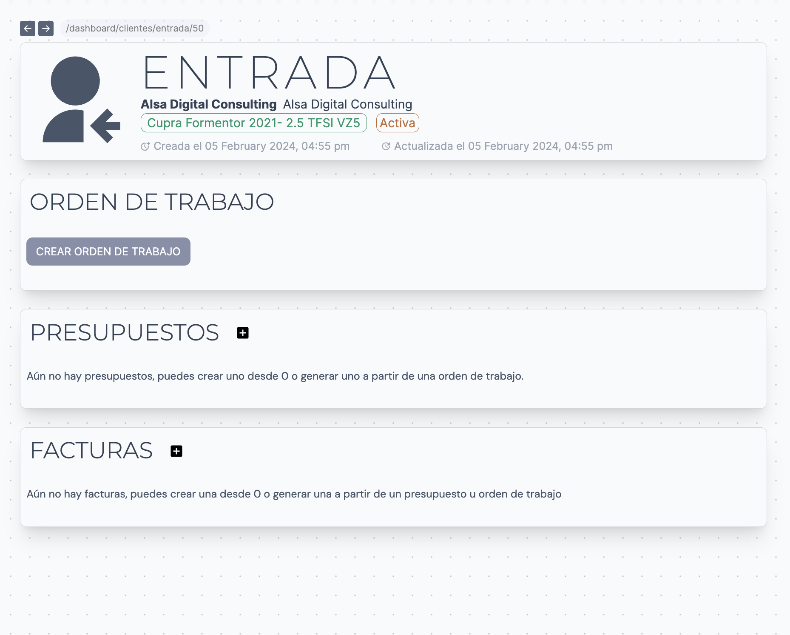

> ⚠️ Recuerda! Las entradas pertenecen al plugin de Facturación. Si está interesado en adquirirlo dríjase a la Alsa App Store.

## General

Para generear Órdenes de trabajo, Presupuestos o Facturas deberemos crear una **Entrada**. Si queremos consultar la entradas relacionadas con cada cliente deberemos entrar en el perfil del cliente y bajar hasta la sección de Entradas. Aquí se mostrará un listado con el histórico. Cada una nos indica la siguiente información:

- Estado `Activa | Finalizada`
- Vehículo asociado a la entrada
- Fecha de creación

Para acceder a la entrada simplemente hacemos click en el listado.

## Crea una entrada

Para ello simplemente nos dirijimos al perfil del cliente al que queramos asociar la entrada y hacemos click en _Nueva entrada_ dentro de la sección Entradas. Esta acción abrirá un pop-up donde deberemos rellenar los siguientes campos:

- Vehículo*
- Notas

> ⚠️ Recuerda! Para crea una entrada es necesario que el cliente tenga como mínimo un vehículo asociado para después asociarlo a la entrada.

## Página de entrada

Una vez en la página de la entrada vemos 4 secciones:

- La cabecera con información básica: Nombre del cliente, vehículo asociado, estado de la entrada y fecha de creación
- Órdenen de trabajo asociada a la entrada seleccionada
- Presupuestos asociadoes a la entrada seleccionada
- Facturas asociadas a la entrada seleccionada

