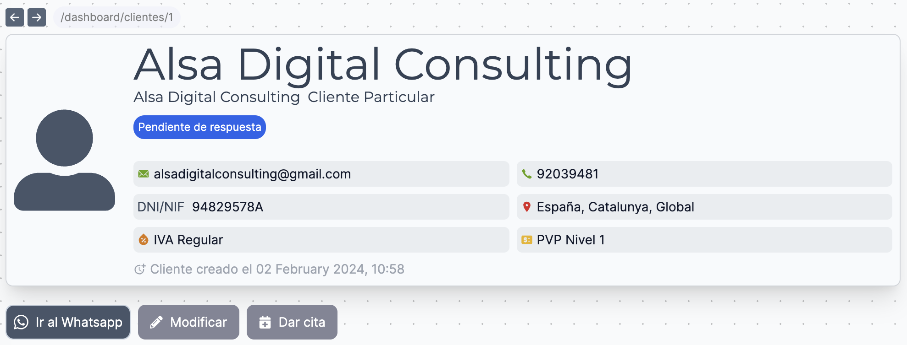
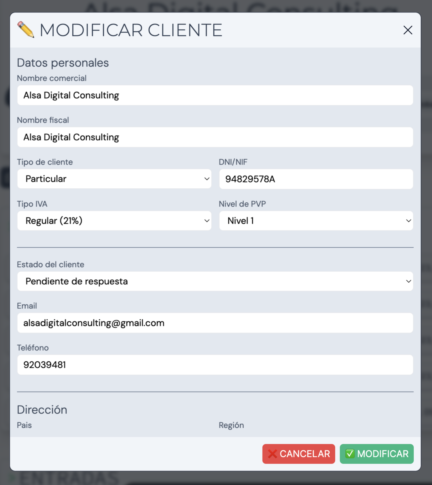
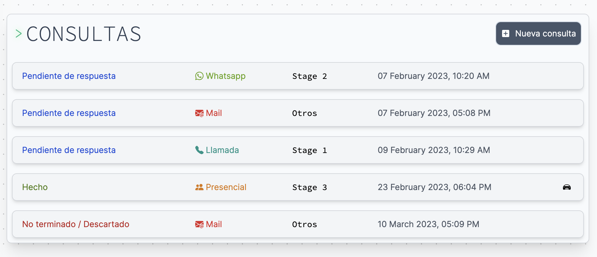
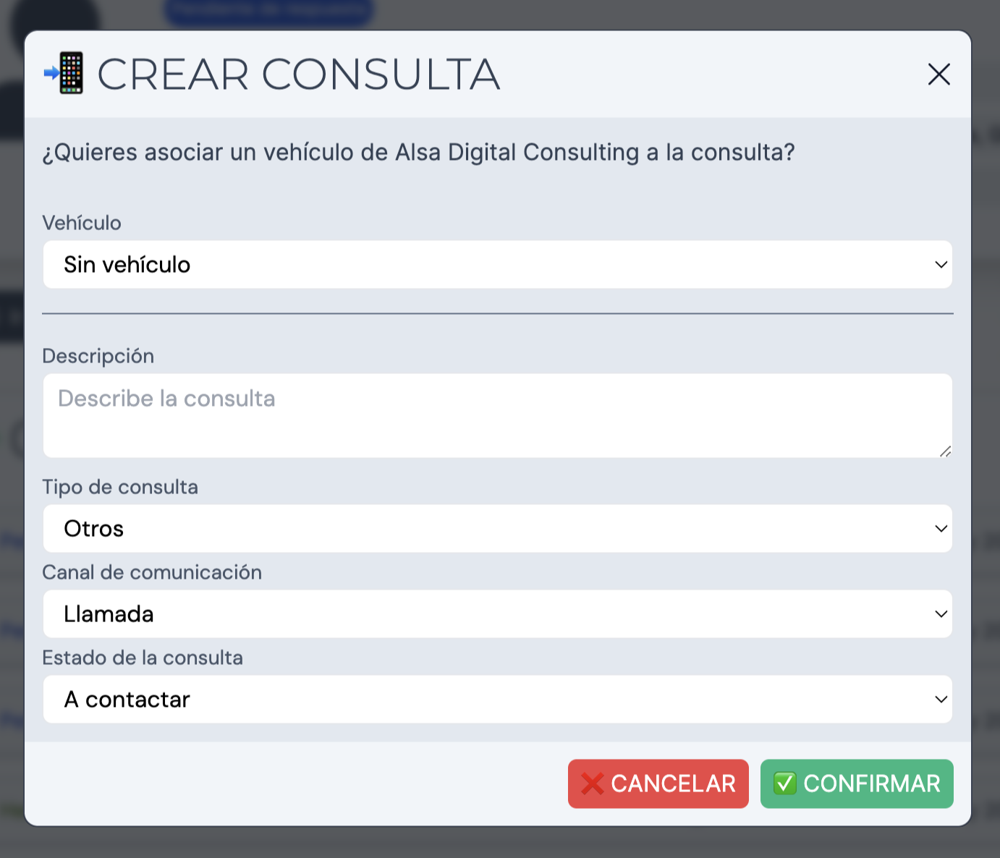
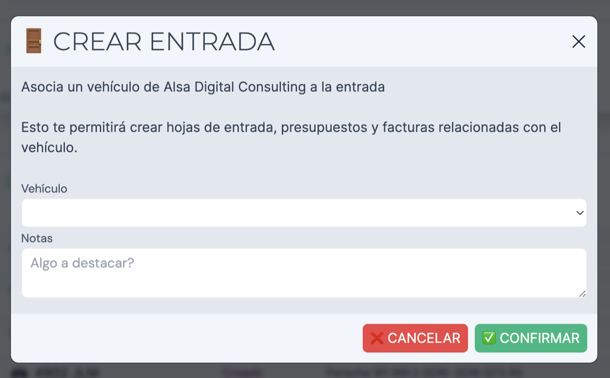
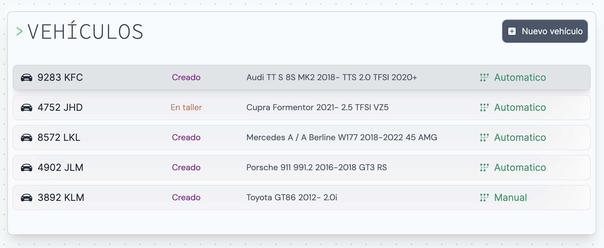
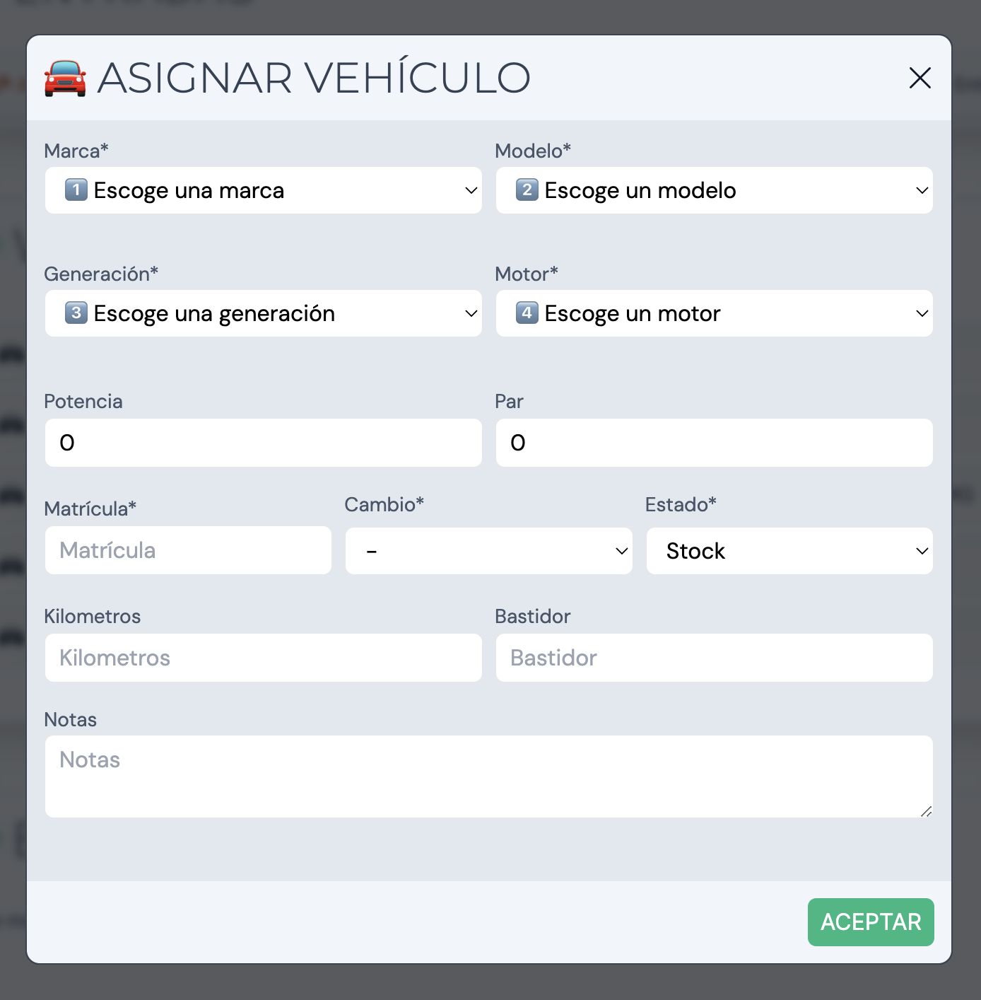
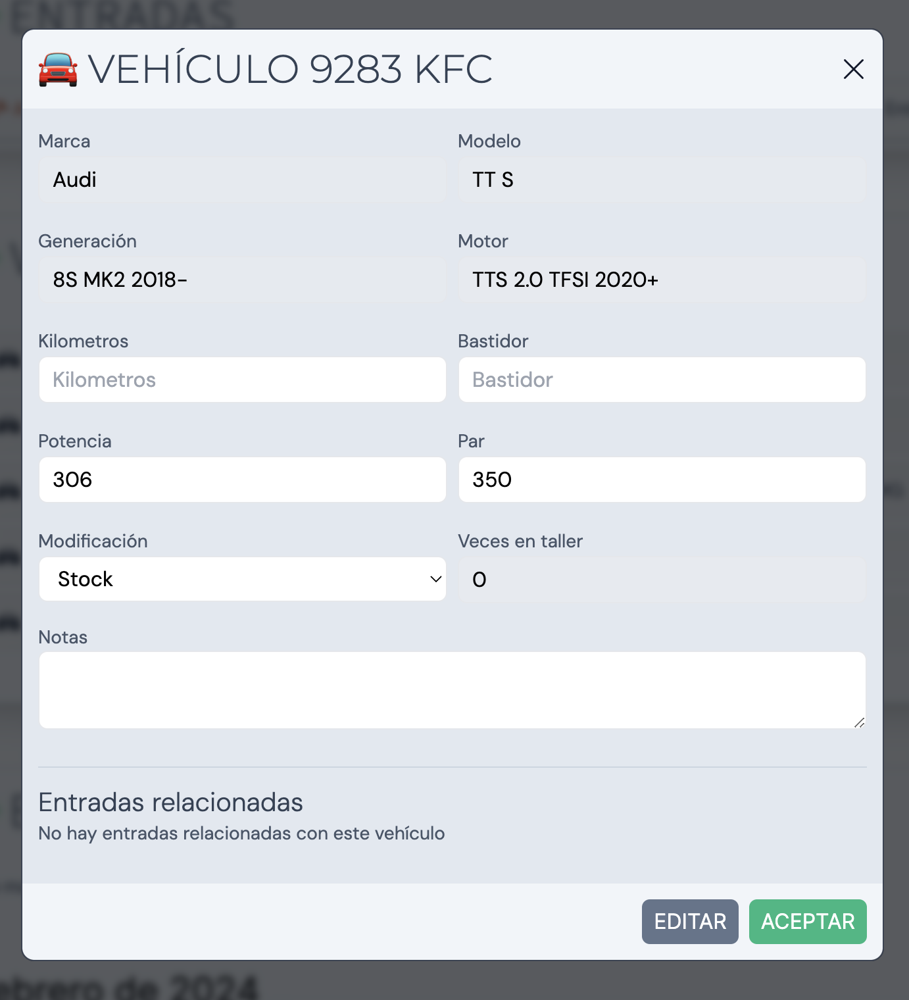
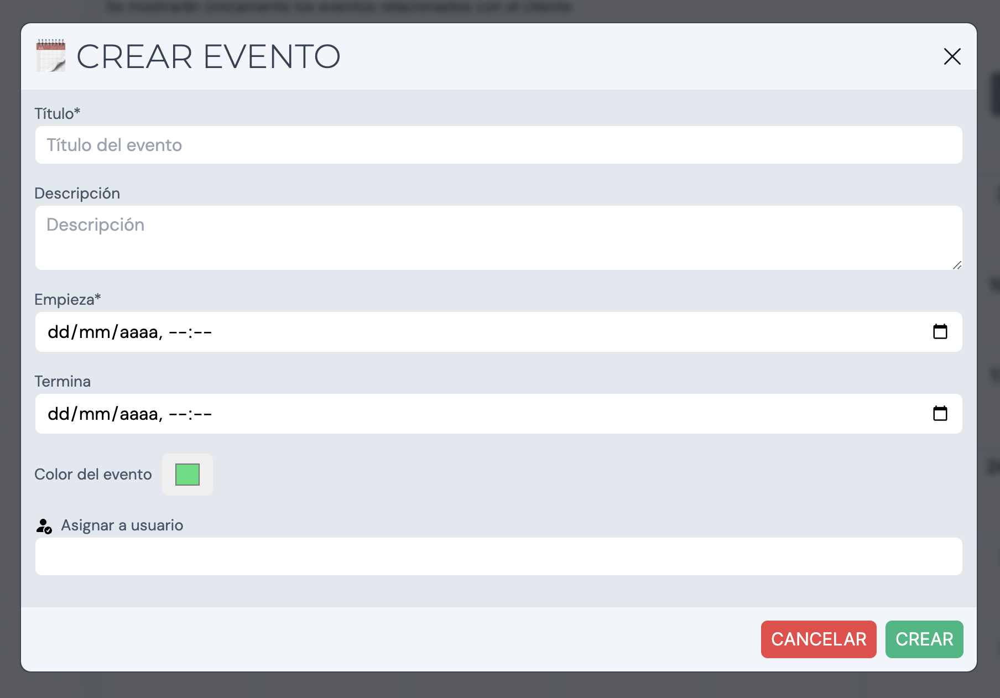

Todos los datos de un cliente en una misma página. Datos de contacto, dirección, consultas, vehículos asociados, entradas, eventos y más!

La ficha de cliente se separa en 4 bloques nativos y 1 perteneciente al plugin _Facturación_

- [Datos personales y estado](#datos-personales)
- [Consultas](#consultas)
- [Entradas](#entradas) `🔌 Facturación`
- [Vehículos](#vehículos)
- [Eventos](#eventos)

## Datos personales y estado

En la parte superior de la ficha de cliente tenemos los datos personales y el estado de éste. El nombre superior (texto grande) hace referencia al Nombre Comercial, mientras que el inferior (texto pequeño) hace referencia al Nombre Fiscal.

Justo debajo muestra el estado del cliente. Este puede ser:

- **Cliente creado**
- **A contactar**
- **Pendient de respuesta**
- **Descartado**
- **Hecho/Finalizado**
- **En desarrollo**
- **Vehículo en taller**

En la parte inferior de la sección disponemos de 3 botónes de acceso directo. Éstos nos permiten acceder al Chat en Whatsapp del número de teléfono asociado al cliente. Además, podemos modificar los datos personales del cliente además de asignarle un evento en el calendario

## Consultas

Esta sección nos muestra el listado de consultas que hay asociadas al cliente. Las consultas se generan automáticamente al recibir un nuevo _Correo electrónico_ de la dirección de correo asociada al cliente. Si el sistema no detecta ninguna consulta activa a través del canal (Mail), creará una nueva con el mensaje del correo entrante. De lo contrario, añadirá el mensaje a una consulta existente
para continuar con la conversación actual.

A simple vista tenemos información básica de la consulta, como su estado, el canal de comunicación, el tipod de consulta y la fecha. Haciendo click en una accederemos a la página de consulta.

### Crear consulta

Para crear una consulta de forma manual nueva hacemos click en el botón **Nueva consulta**. Éste abrirá un pop-up donde podremos rellenar los datos necesarios para generar una consulta:

- Vehículo `Selector`
- Descripción de la consulta
- Tipo de consulta `Stage 1 | Stage 2 | Stage 3 | Taller | Otros`
- Canal de comunicación `Llamada | Whatsapp | Mail | Presencial | Redes Sociales`
- Estado de la consulta
  - A contactar
  - Pendiente de respuesta
  - Hecho
  - No terminado / Descartado
  - En desarrollo

## Entradas

>La sección de Entradas pertenece al plugin de _Facturación_.

Esta sección nos muestra el listado de entradas asociadas al cliente. Gracias a las entradas podemos generar documentos de facturación como Órdenes de trabajo, Presupuestos y Facturas.

### Crear entrada

Para crear una entrada de forma manual, hacemos click en el botón **Nueva entrada**. Éste abrirá un pop-up donde podremos rellenar los datos necesarios para generar una consulta:

- Vehículo*
- Notas

## Vehículos

En esta sección tenemos el listado de vehículos asociados al cliente. Los vehículos nos sirven tanto para relacionarlos con los clientes, relacionarlos con las entradas y mantener un seguimiento entre el vehículo y el taller.

### Asignar vehículo

Para crear un nuevo vehículo hacemos click en el botón **Nuevo vehículo**. Éste abrirá un pop-up donde podremos rellenar los datos del vehículo. Dispondrás de una amplia base de datos de Marcas, Modelos, Generaciones y Motores.
Los campos a rellenar son los siguientes:

- Marca*
- Modelo*
- Generación*
- Motor*
- Potencia (CV)
- Par (NM)
- Matrícula
- Cambio `Manual/Automático`*
- Estado o modificación `Stock | Stage 1 | Stage 2 | Stage 3`*
- Notas

### Modificar vehículo

Si hacemos click en un vehículo se abrirá un pop-up con la información de este. En esta misma ventana podemos modificar los datos del vehículo:

## Eventos

Crea y relaciona eventos y clientes en el calendario. El calendario de la ficha de cliente muestra únicamente los eventos relacionados con el cliente seleccionado. De esta manera tenemos una vista más limpia y accesible a cualquier evento relacionado.

### Crear evento

Para crear un nuevo evento asociado al cliente hacemos click en el botón **Nuevo evento**. También podemos hacer click en un día del calendario para crear un nuevo evento. Esta acción abrirá un pop-up con los siguientes campos a rellenar:

- Título*
- Descripción
- Empieza* `(Fecha de inicio)`
- Termina `(Fecha de finalización en caso de haberla)`
- Color del evento
- Asignar a usuario

### Marcar evento como tarea

Es posible marcar un evento como tarea. Si seleccionamos un usuario del sistema en la pestaña _Asignar usuario_, el evento se marcará automáticamente como una tarea (Asignada por ti al usuario indicado).

Esto nos permite mantener un orden entre eventos. Haz click aquí para saber más sobre el calendario.

Una vez creado el evento podremos consultarlo tanto en la página de calendario como en el calendario de la ficha de cliente

### Modificar o eliminar un evento

Al hacer click en un evento dentro del calendario, se nos abrirá un pop-up con la información del evento. Aquí podemos tanto modificar la información como eliminarlo definitivamente.