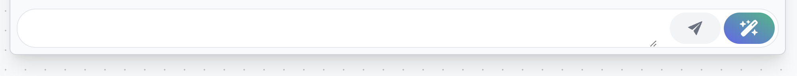

Accede a todos los datos relacionados con una consulta, incluyendo la bandeja de entrada.

## Datos de la consulta

En la parte superior de la página tenemos la cabecera. Nos muestra el nombre del cliente asociado a la consulta, el estado de la consulta y el botón de acceso al chat de Whatsapp en caso de detectar un número de teléfono en la ficha de cliente

### Modificar los datos

En caso de querer modificar los datos o el estado de la consulta, podemos directamente sobreescribir las casillas que se muestran en al cabecera. Los datos que podemos modificar son los siguientes:

- Descripción
- Tipo `Stage 1 | Stage 2 | Stage 3 | Taller | Otros`
- Canal `Llamada | Whatsapp | Mail | Presencial | Redes Sociales`
- Estado
    - A contactar
    - Pendiente de respuesta
    - Mail
    - Presencial
    - Redes Sociales

Al modificar cualquiera de los datos, automáticamente aparecerá un botón con el texto **Modificar**. Es necesario hacer click en él para aplicar los cambios.

## Vehículo

En caso de haber asociado un vehículo a la consulta, tendremos acceso a su información en al sección inferior a la cabecera:

Podemos maximizar o minimizar la pestaña haciendo click en la flecha situada en la parte superior derecha de la sección.

## Bandeja de entrada

La bandeja de entrada reúne todos los correos que intercambiamos con el cliente en cada consulta. Nos permite dar respuesta a sus correos y envíar archivos de hasta 200 MB.

### Enviar email

Para enviar un email tenemos la caja de texto en la parte inferior de la bandeja de entrada. Ésta caja de texto se puede hacer más alta si hacemos click en la esquina inferior derecha y arrastramos hacia abajo.

Una vez hayamos redactado la respuesta podemos hacer click en el botón del _Avión de papel_. Éste abrirá un pop-up con el resumen del correo para revisarlo antes de ser mandado. Aquí podemos modificar todo el contenido de forma más ámplia:

- Asunto
- Mensaje
- Archivos adjuntos

Al hacer click en enviar, se enviará y actualizará los datos de la consulta para reflejar tu respuesta en el historial de correos.

### Mensajes predefinidos

Los mensajes predefinidos nos permiten contestar rápidamente a correos con plantillas préviamente configuradas. Si aún no tienes mensajes predefinidos puedes hacer click en el texto _"en tu perfil"_ para acceder al configurador.

### ✨ Respuestas inteligentes

Gracias a la inteligencia artificial hemos podido implementar un sistema de generación de respuestas automático. De esta manera, el sistema lee el último mensaje por parte del cliente y desarrolla una posible respuesta.

Para generar una respuesta, haz click en el botón coloreado (botón situado a la derecha). Abrirá un pop-up con el resumen de correo junto a la respuesta que ha generado el sistema.

> ⚠️ Recuerda! Revisa la respuesta generada por IA. Pese a ser un modelo computacional evolucionado, las respuestas pueden no ser exactas o adecuadas a la situación.

Al hacer click en enviar, se enviará y actualizará los datos de la consulta para reflejar tu respuesta en el historial de correos.

## Cambiar de consulta

Para cambiar de consulta sin salir de la página o volver al listado, puedes hacer click en uno de los botónes de la cabecera.

La posición de las consultas se define al acceder al listado de consultas. Es decir, una vez visitmos el listado y posteriormente entremos en una, ya se habrá establecido el orden de las siguientes y anteriores consultas.