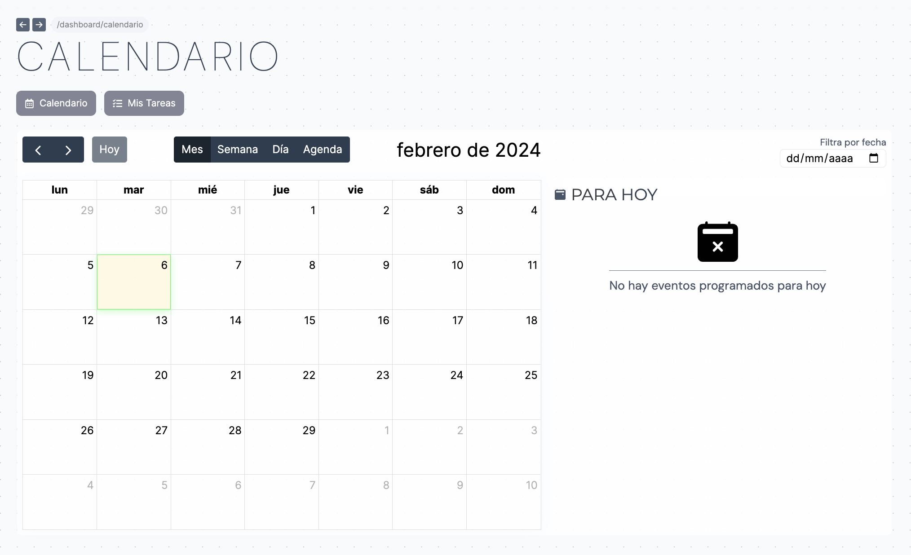
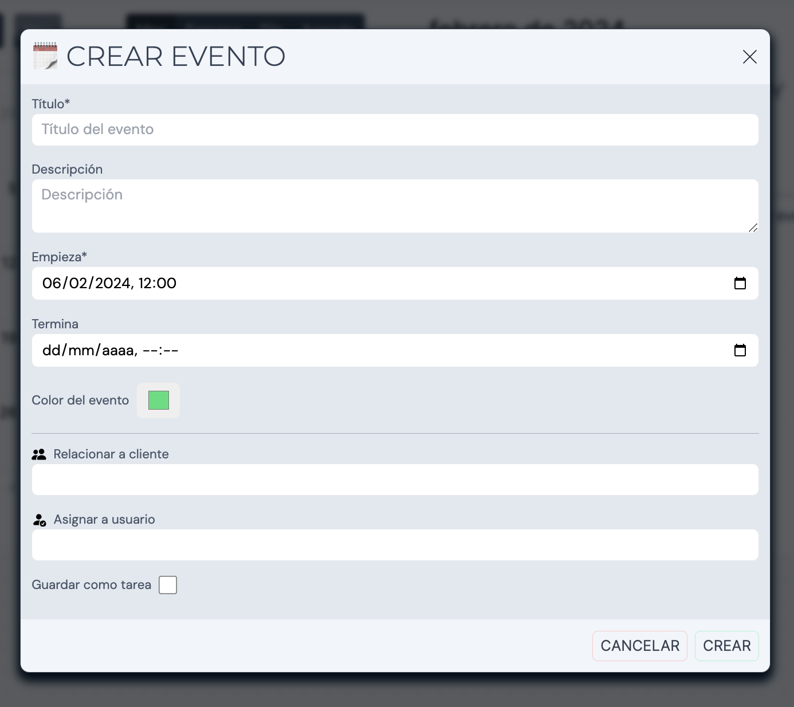
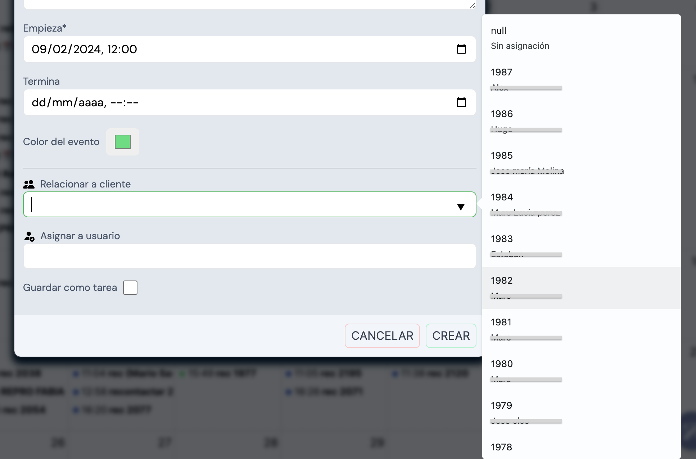
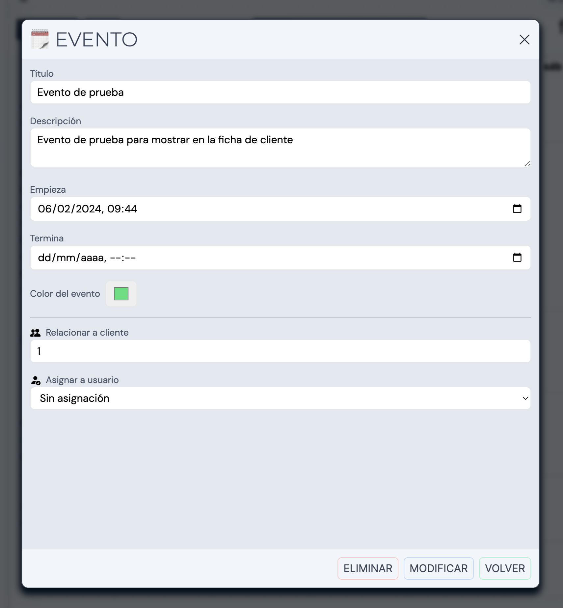

## Vista de eventos

Esta vista nos muestra los eventos registrados con la posibilidad de cambiar la cuadrícula a Mes, Semana, Día o Agenda.

En la zona derecha se mostrarán aquellos eventos que estén programados para la fecha actual. También tenemos la posibilidad de filtrar por fecha haciendo click en el selector de fecha ubicado en la zona superior derecha.

### Crear un evento

Para crear un nuevo evento en el calendario simplemente hacemos click en el día que queramos marcar como inicio del evento y automáticamente se abrirá el pop-up de _Crear evento_. Los campos a rellenar son los siguientes:

- Título*
- Descripción
- Empieza* (Fecha de inicio)
- Termina (Fecha de finalización)
- Color del evento
- Relacionar a cliente
- Asignar a usuario
- Guardar como tarea

Si dejamos vacío el campo _Termina_, no se establecerá una fecha de finalización para el evento.

### Relacionar evento con cliente

Para relacionar un evento con un cliente tenemos que rellenar la casilla _Relacionar a cliente_. En la misma casilla podemos buscar un cliente por su id o nombre. Éste aparecerá (si existe) en la lista y al seleccionarlo quedará reflejado el ID del cliente en la casilla.

### Marcar evento como tarea

Al crear un evento, si seleccionamos un Usuario del Sistema en la casilla _Asignar a usuario_, automáticamente se marcara como tarea (asignada por ti al cliente indicado).
El usuario indicado podrá visualizar la tarea como pendiente al iniciar sesión con su cuenta y acceder al panel de **Tareas**

## Modificar o eliminar un evento

Para modificar un evento tenemos que ubicarlo en el calendario y hacer click en su título. Veremos el pop-up con la información del evento. Una vez hechos los cambios tendremos que aplicarlos dando click al botón de _MODIFICAR_.

En caso de querer eliminarlo bastará con hacer click en el botón de _ELIMINAR_

