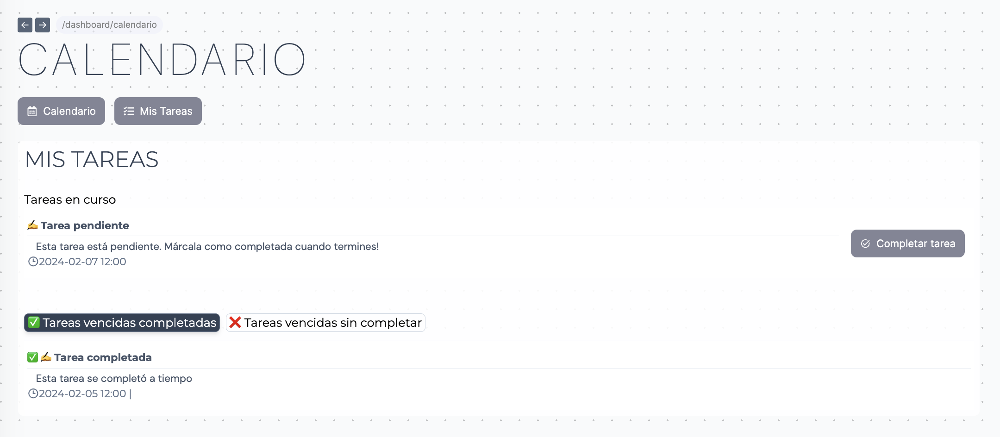
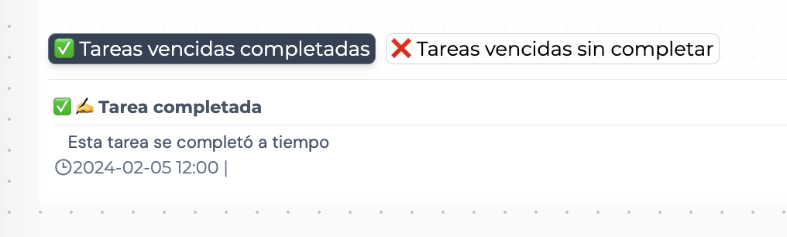
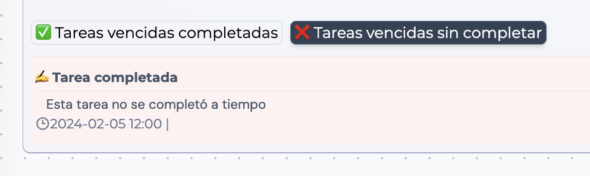

## Vista de tareas

Esta vista nos muestra los eventos que han sido configurados como tareas y asignados a nuestro usuario.

## Tareas en curso

El primer listado muestra aquellas tareas que están pendientes de realizar. Una vez terminada debemos hacer click en el botón de _Completar tarea_.

Para ver toda la información del evento podemos hacer click en su título. Abrirá un pop-up con toda la información.

## Tareas vencidas

Aquellas tareas que ya hayan finalizado se mostrarán en este apartado. Podemos filtrarlas por completadas y sin completar.

### Completadas

Listado de tareas vencidas completadas a tiempo:

### Sin completar

Listado de tareas vencidas sin completarse a tiempo:

