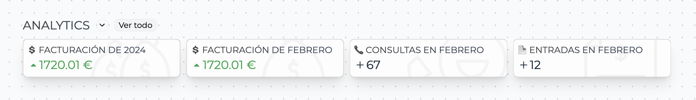
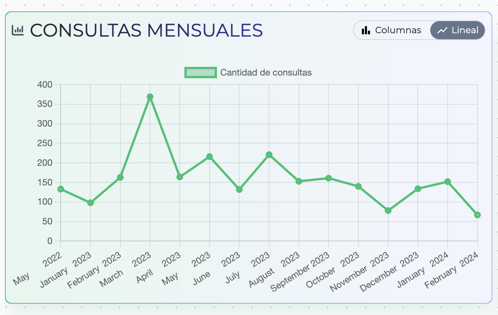

> ⚠️ Recuerda! Analytics pertenece al plugin de Analytics. Si está interesado en adquirirlo dríjase a la Alsa App Store. Dependiendo de los plugins activados se mostrará una información u otra.

Analiza los datos registrados en tu sistema. Controla y compara las consultas entrantes y la facturación en la línea temporal.

## Página de analytics

Al acceder a la página de Analytics se observan 3 secciones:

- Widgets de Analytics
- Consultas atendidas
- Gráficas

### Widgets de analytics

Estos fragmentos proporcionan información básica de la analítica de nuestro sistema, datos como la facturación anual y mensual, las consultas entrantes del mes actual y las entradas entrantes del mes actual. Este apartado también lo podemos encontrar en la página de inicio a modo de vista rápida.

### Consultas atendidas

En consultas atendidas se pueden filtrar las consultas entrantes de un día específico y comparar aquellas que en algún momento fueron atendidas, tanto si se accedió a la conversación de Whatsapp como si se contestó alguna vez en la bandeja de entrada.

En el filtro de fecha se indica el día de las consultas a filtrar para mostrar el listado.

Una vez listadas se observan 5 columnas:

- ID de la consulta
- Nombre del cliente
- Fecha entrante
- Atención a través de Whatsapp
- Atención a través de Email

Los campos de atención hacen referencia a si la consulta fué atendida a trvés de Whatsapp o Email. En caso de haber sido atendida se mostrará un tick verde ✅ junto al nombre del operario que realizó la acción y la fecha y hora de la atención.

Si se hace click en un registro accederemos a la página de la consulta correspondiente.

### Gráficas

Gracias a las gráficas hay un control más visual sobre lo que sucede en cuanto a la entrada de consultas y facturación. Algunos fragmentos con gráfica disponen de un selector de vista, donde se puede alternar entre 2 tipos de gráfica:

- Columnas
- Lineal

A simple vista los gráficos principales son:

- Consultas mensuales
- Facturación mensual
- Facturación anual
- Canales de entrada
