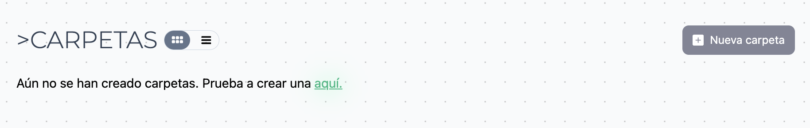
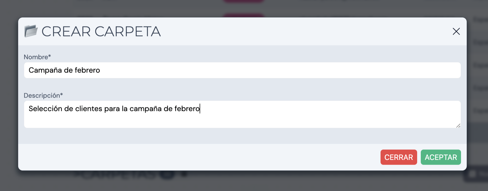
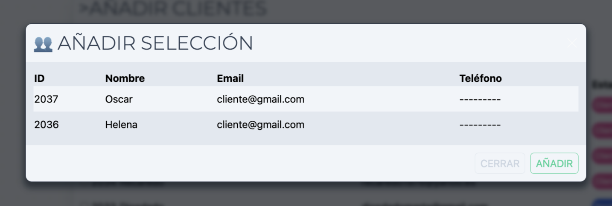
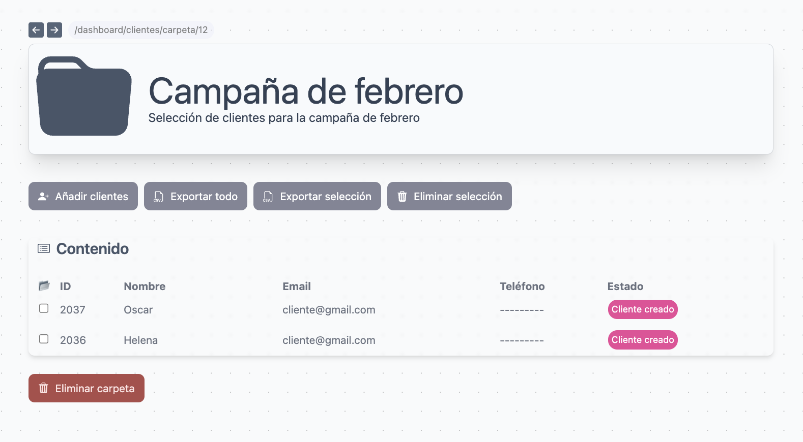
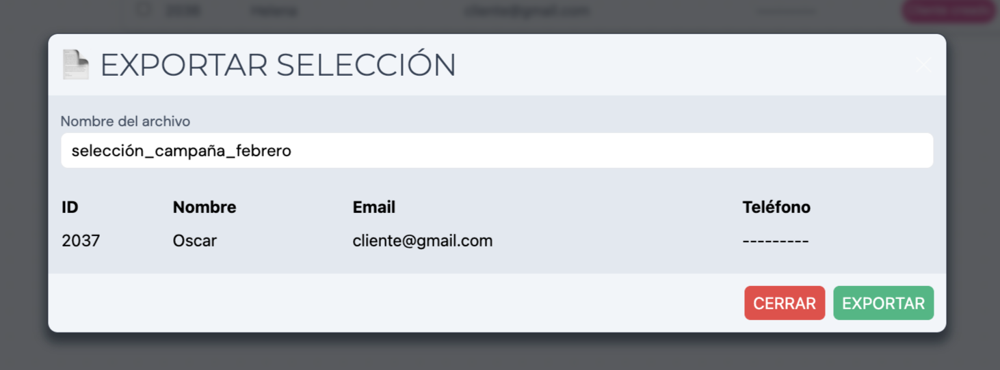
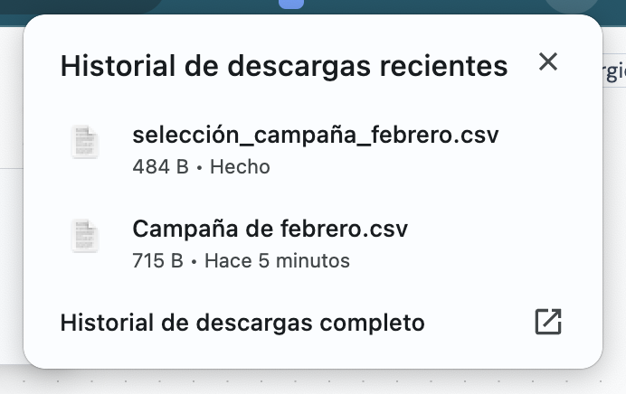

Organiza los clientes del sistema con el sistema de carpetas. Exporta carpetas o una selección de elementos determinada en CSV.

## Crea una carepta

Al hacer click en el botón de _Nueva carpeta_ abrimos un pop-up donde se indica el nombre y descripción de la carpeta.

Una vez creada nos llevará a la carpeta, donde podremos comenzar a añadir clientes.

## Página de carpeta

En la parte superior de la página se muestra la cabecera de la carpeta, con la información del nombre y descripción de esta. La sección inferior muestra las opciones disponibles para trabajar con la carpeta:

- Añadir clientes
- Exportar todo
- Exportar selección
- Eliminar selección

### Añadir clientes

Al hacer click en _Añadir clientes_ se mostrará el listado de clientes del sistema. De esta manera se podrán seleccionar para

Una vez seleccionados haremos click en _Añadir selección_. En el pop-up se mostrará la selección para confirmarla y añadirla a la carpeta.

### Exportar todo

Al hacer click en exportar automáticamente se descargará un documento CSV con todo el contenido de la carpeta.

### Exportar selección

Al hacer click en _Exportar selección_ se abrirá un pop-up con el listado de elementos seleccionados en la carpeta. Podemos incluir un nombre al archivo que se exportará.

### Eliminar selección

Para eliminar una selección de elementos en una carpeta simplemente hacemos click en el botón _Eliminar selección_ y posteriormente confirmar la acción.

> ⚠️ Cuidado! Estos cambios no son reversibles.

## Eliminar carpeta

Para eliminar la carpeta y su contenido hacermos click en la parte inferior de la carpeta donde se sitúa el botón _Eliminar carpeta_. Finalmente confirmamos su eliminación.

> ⚠️ Cuidado! Estos cambios no son reversibles.
