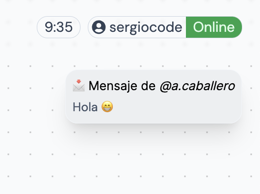

## Chats

Al acceder a la página de Chats se mostrarán dos columnas. La columna izquierda muestra el listado de contactos del sistema, mientras que en la columna derecha se muestra el chat seleccionado con su correspondiente conversación.

Para acceder a un chat hay que hacer click en el contacto y automáticamente se mostrará el chat en la parte derecha.

### Enviar mensajes

Enviar mensajes es muy sencillo. Simplemente hay que hacer click en el cuadro de texto para redactar nuestro mensaje. Una vez redactado se envía dando click en el icono del _"Avión de papel"_.

## Notificaciones

Gracias a las notificaciones temporales podemos consultar de forma intuitiva el último mensaje recivido.

