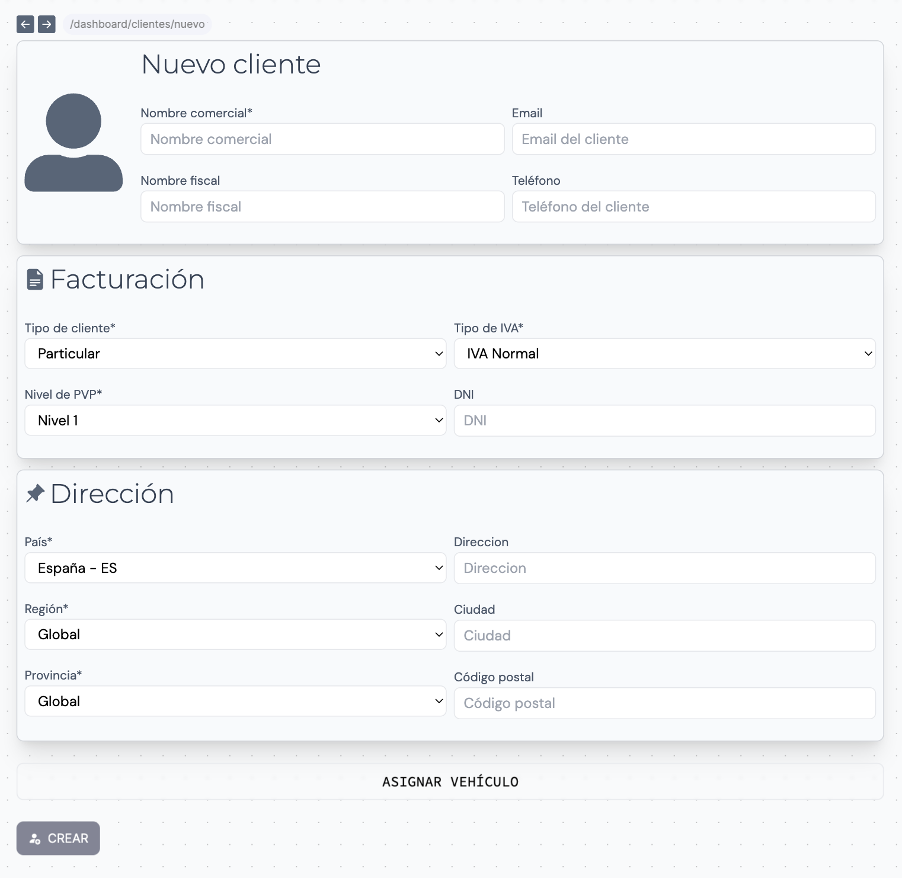
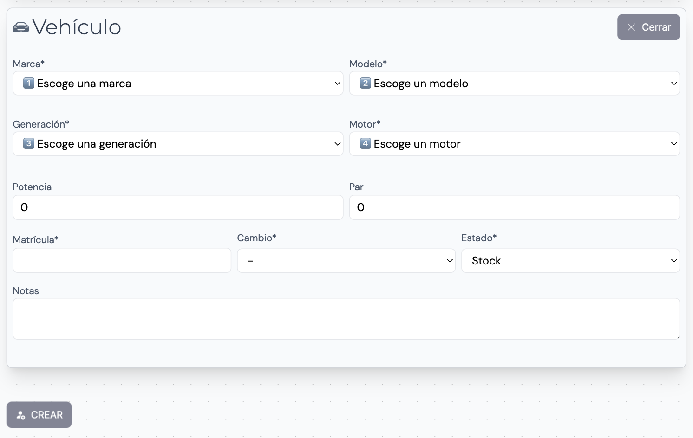

Añade de forma manual clientes a la base de datos desde el creador de clientes. Haz click en el botón de **Crear** para acceder y rellenar la ficha

## Rellenar datos

Al acceder al creador de clientes verás los campos a rellenar.

>⚠️ Recuerda! Los campos marcados con un asterisco (*) son obligatorios para poder crear el cliente

### Datos generales

El nombre comercial, nombre_fiscal, email y teléfono son datos básicos para la crear un cliente

### Facturación

Estas son las opciones disponibles para los campos de facturación:

- Tipo de cliente `Particular | Profesional`
- Tipo de IVA `Normal | Exento`
- Nivel de PVP `Nivel 1 | Nivel 2 | Nivel 3`
- DNI

Los 3 niveles de PVP corresponden a diferentes precios que se pueden asignar a los productos del inventario. De forma que en los documentos de facturación (Órdenes de trabajo, Presupuestos y Facturas), al seleccionar un producto o servicio del inventario automáticamente se establecerá el precio correspondiente.

>⚠️ Recuerda! Una vez editamos un documento de facturación podemos modificar el precio de los productos y servicios sin indiferentemente del Nivel de PVP del cliente.

### Dirección

Establece la dirección del cliente en los siguientes campos:

- País
- Región
- Provincia
- Dirección
- Ciudad
- Código postal

Los 3 niveles de PVP corresponden a diferentes precios que se pueden asignar a los productos del inventario. De forma que en los documentos de facturación (Órdenes de trabajo, Presupuestos y Facturas), al seleccionar un producto o servicio del inventario automáticamente se establecerá el precio correspondiente.

### Asignar un vehículo

Ahora es posible crear un cliente a la misma vez que le asociamos un vehículo. Para ello haz click en el botón inferior **Asignar vehículo**. Automáticamente se abrirá una pestaña donde podremos rellenar los datos del vehículo:

- Marca*
- Modelo*
- Generación*
- Motor*
- Potencia
- Par
- Matrícula
- Cambio `Manual/Automático`*
- Estado o modificación `Stock | Stage 1 | Stage 2 | Stage 3`*
- Notas

