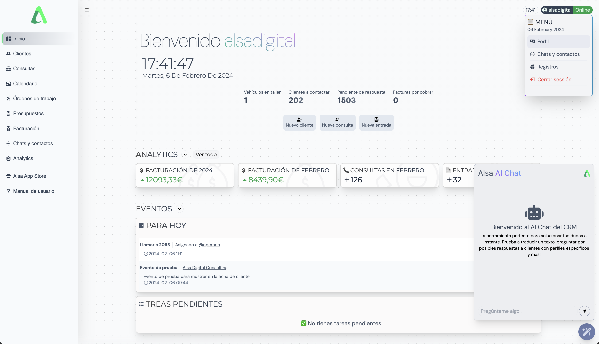
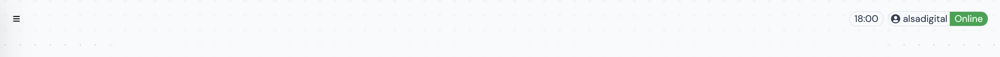
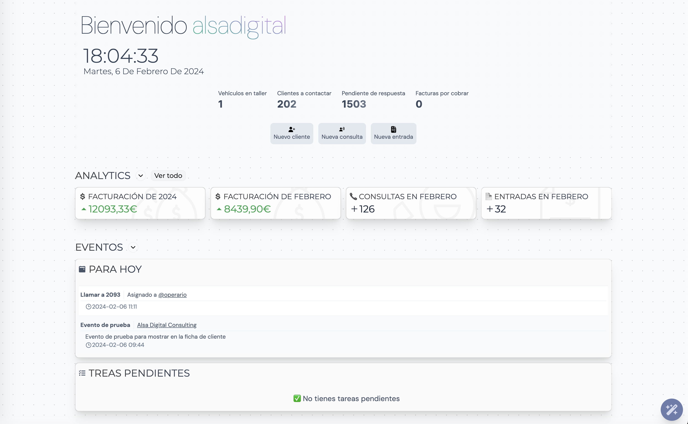
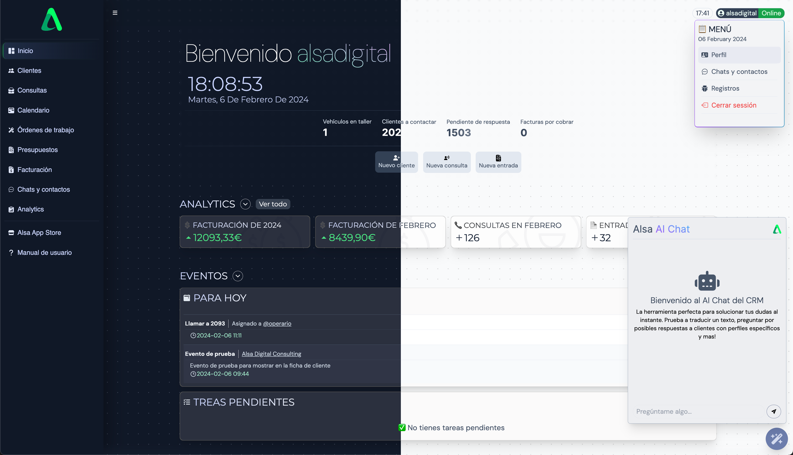

Bienvenido al panel de control del CRM.

> ⚠️ RECUERDA! Los contenidos mostrados en el manual de usuario pueden variar dependiendo de los plugins.

Éste se divide en 3 secciones:

- [Sidebar Menu](#sidebar-menú)
- [Navbar y Context Menu](#navbar-menú)
- [Dashboard content](#dashboard-content)

## Secciones

### Sidebar Menú

En la zona izquierda de la pantalla se sitúa la Sidebar Menu. Este menú nos facilita accesos directos a diferentes secciones del CRM. Si quermos una vista más amplia del Dashboard Content podemos hacer click en las tres líneas de la navbar para ocultar el menú.

### Navbar Menú

La Navbar se ubica en la parte superior de la pantalla. Aquí podemos ver el estado de nuestra conexión con el servidor además de acceder a más opciones y accesos directos montando el cursor en nuestro nombre de usuario.

### Dashboard Content

Los contenidos se mostrarán entre los menús superiores y laterales.

En la página principal tenemos 2 secciones de accesos directos. La primera sección se divide en:

- Vehículos en taller
- Clientes a contactar
- Pendientes de respuesta
- Facturas por cobrar `🔌 Facturación`

Si hacemos click en cualquiera de los anteriores accesos aparecerá un pop-up en pantalla con el listado correspondiente.

La segunda sección nos ofrece botones de acceso a:

- Nuevo cliente
- Nueva consulta
- Nueva entrada `🔌 FActuración`

## Tema

Cambia de tema en función a la configuración de tu dispositivo. Si el dispositivo está configurado de forma automática, el CRM cambiará de modo día a modo oscuro automáticamente.

