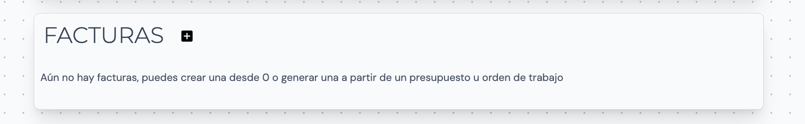
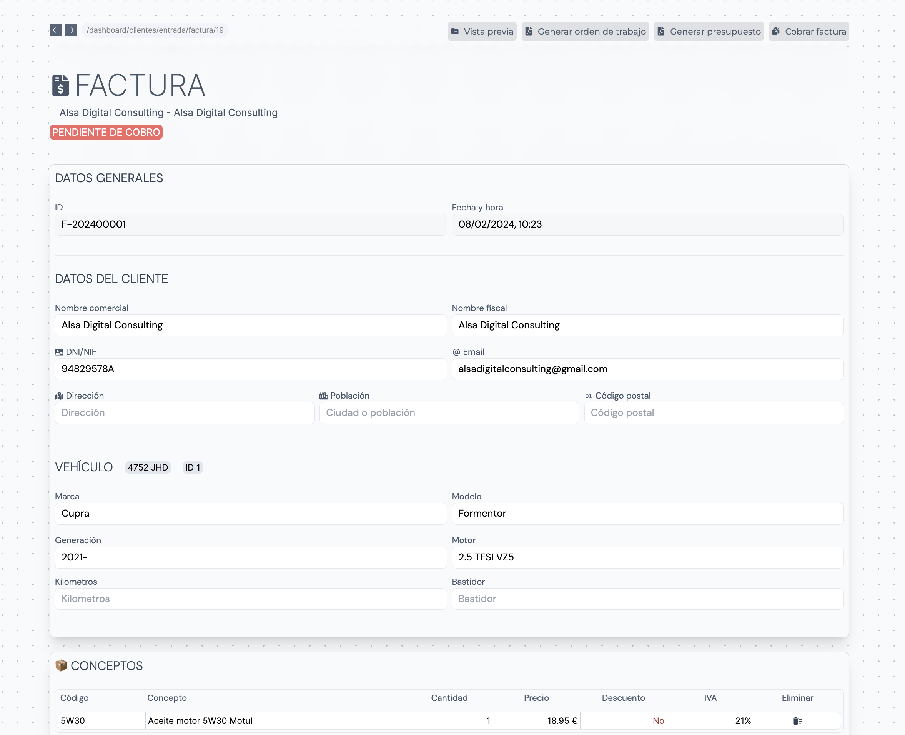
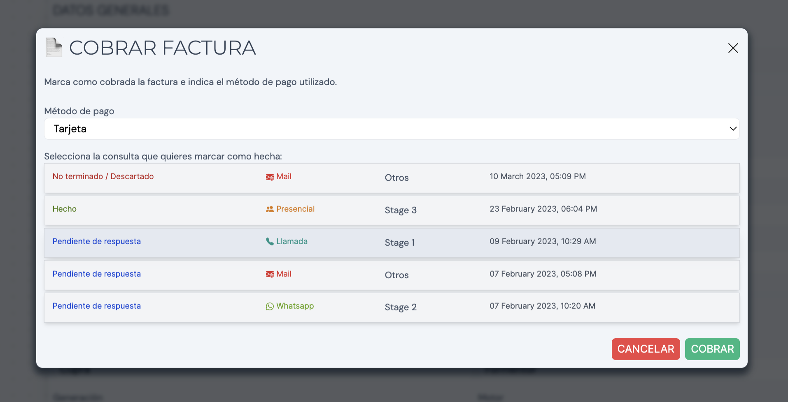
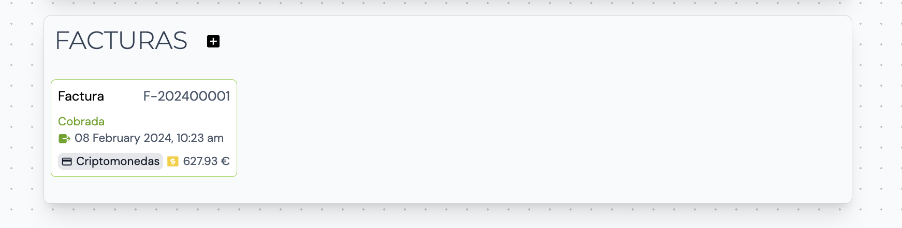
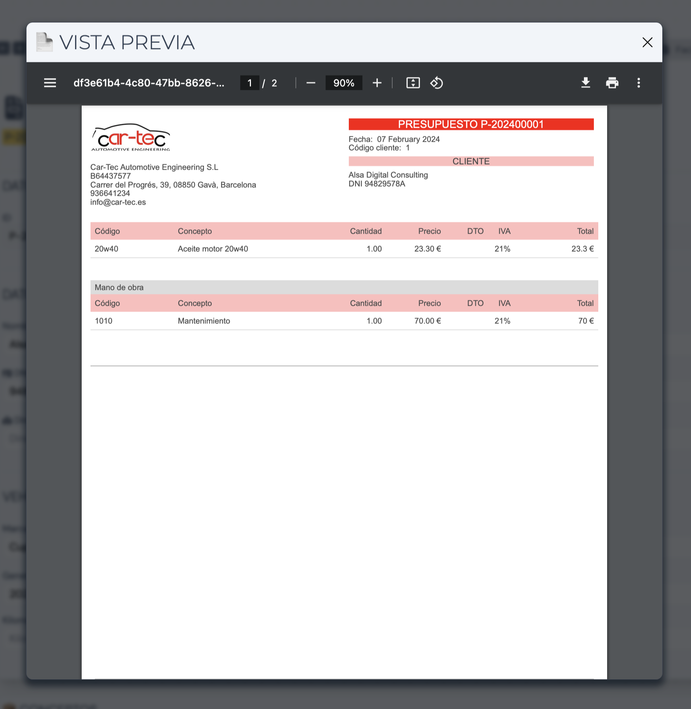
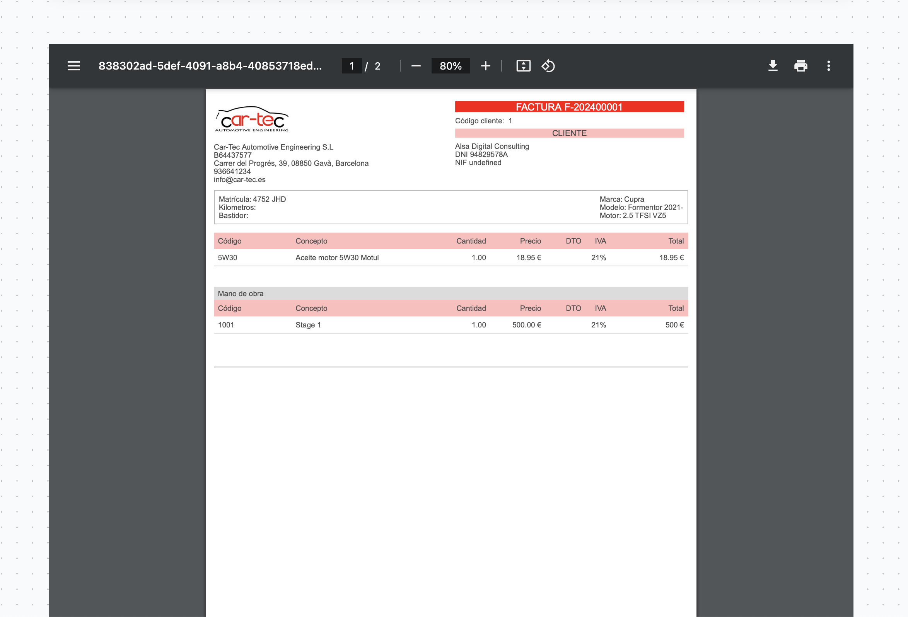
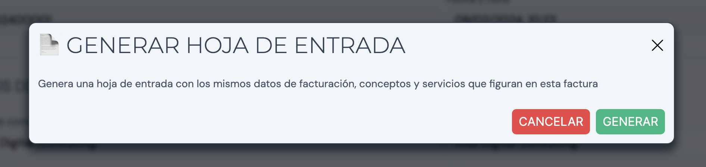
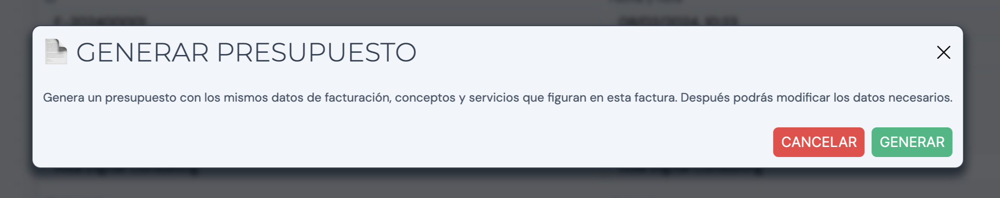

Las facturas almacenan datos de un cliente junto a una serie de conceptos y servicios. Estos se almacenan y pueden ser imprimidos en formato PDF. Una vez cobrada una factura, automáticamente se marca la entrada como _Finalizada_.

## Crea una factura

> ⚠️ Recuerda! Para crear un factura tenemos que crear previamente una [entrada](/guia/entradas)

Tenemos 3 maneras de crear una factura:

1. Generamos una factura en base a una orden de trabajo. Haz [click aquí](/es/guia/ordenes-trabajo/#presupuestar-orden-de-trabajo) para más información.

2. Generamos una factura en base a un presupuestos. Haz [click aquí](/es/guia/presupuestos/#facturar-presupuesto) para más información.

3. Creamos una factura de 0 desde la página de la entrada

Automáticamente aparecerá la página de creación de la factura:

### Datos generales

Los datos generales de la factura se resumen en el ID de la factura, si está cobrada o no y el método de pago. El ID se genera automáticamente de forma que no haya colisión entre otros documentos. La estructura de este ID se basa en el año actual seguido del número de serie generado.

### Datos del cliente

Los datos del cliente se rellenan automáticamente. Podemos modificarlos según nos convenga. Si hay campos que no se han rellenado automáticamente se debe a que el cliente no tiene ese dato registrado en su perfil. Los datos del cliente son los siguientes:

- Nombre comercial
- Nombre fiscal
- DNI (o documento)
- Email
- Dirección
- Población
- Código postal

### Vehículo

En la sección de **Vehículo** tenemos los datos del vehículo asociado tanto a la Entrada como a la factura. Este apartado también se completará automáticamente con los datos obtenidos.
Es posible añadir manualmente el kilometraje y el número de bastidor.

### Conceptos

#### Añadir concepto

Los conceptos y materiales de la factura se añaden en la sección de _Conceptos_. Los campos disponibles para rellenar son los siguientes:

- Código
- Concepto
- Cantidad
- Precio
- Descuento (%)
- IVA
  - La casilla de IVA mostrará por defecto el IVA dependiendo de si el cliente figura como Regular o Intracomunitario. Podemos modificar manualmente el valor.

Al hacer click en la casilla _Código_ se abrirá una ventana flotante con el listado de Conceptos registrados en la base de datos. Para buscar uno tenemos que escribir y conforme se rellena, la ventana nos muestra los resultados que coinciden.

Al hacer click en uno de ellos se seleccionará y se completarán el resto de casillas con los datos guardados por defecto en nuestro Inventario de Conceptos. Podemos modificar manualmente los datos convenientes (Cantidad, Precio, etc)

Si no hay ningúna coincidencia en la búsqueda de conceptos podemos crear uno nuevo haciendo click al texto _Añadir concepto al inventario_

Se abrirá un pop-up con el formulario para registrar el nuevo concepto. Las casillas a rellenar son las siguientes:

- Concepto* ➡️ Nombre del concepto
- Código* ➡️ Código para referenciar al concepto
- Pvp Nivel 1*
- Pvp Nivel 2
- Pvp Nivel 3

Al darle a crear automáticamente se guardará el concepto en el Inventario además de rellenar los campos del concepto que estábamos registrando préviamente en la factura.

Una vez hayamos rellenado todos los campos tenemos que hacer click en el botón de la esquina inferior derecha _Añadir concepto_. Al hacer click el concepto se añadirá a la lista de conceptos.

#### Eliminar concepto

Si queremos eliminar un concepto nos dirigimos a él en el listado y hacemos click en la última castilla que corresponde con la columna _Eliminar_ 🗑️

### Servicios

Los servicios de la factura se añaden en la sección de _Servicios_. Los campos disponibles para rellenar son los siguientes:

- Código
- Concepto
- Cantidad
- Precio
- Descuento (%)
- IVA
  - La casilla de IVA mostrará por defecto el IVA dependiendo de si el cliente figura como Regular o Intracomunitario. Podemos modificar manualmente el valor.
- Operario
  - Selecciona un operario de la lista de contactos para asignarle las horas de trabajo.

El funcionamiento de los servicios es similar al de los conceptos a excepción de la casilla de _Operario_. Para añadir servicios registrados o no préviamente en el Inventario de servicios, realizamos el mismo proceso que en el apartado anterior _Añadir concepto_

Una vez rellenados los campos hacemos click en el botón de la esquina inferior derecha _Añadir servicio_ para añadirlo a la lista.

## Finalizar la creación

Una vez terminemos de configurar los conceptos y servicios en la factura, haremos click en el bóton fijo en el menú superior _Crear factura_.

Cuando la factura se procese en la base de datos, automáticamente nos redirigirá al documento ya creado.

## Documento

Una vez generada la factura podemos acceder al documento y ver el contenido de esta:

Si no hemos cobrado la factura antes de crearla, se mostrará un indicador rojo con el texto _PENDIENTE DE COBRO_

### Cobrar factura

Para cobrar la factura haremos click en el botón fijo del menú superior con el texto _Cobrar factura_.

Esta acción abrirá un pop-up con donde escogeremos el método de pago que se ha utilizado para cobrar la factura. Además, tenemos la posibilidad de seleccionar una de las consultas del cliente para marcarla como _✅ Hecha_.

Al cobrase el sistema nos redirijirá a la Entrada, donde veremos la factura cobrada:

### Visualizar PDF

Hay 2 maneras de visualizar el PDF de la factura.

1. Haz click en el botón _Vista previa_ de la parte superior derecha de la página. De esta manera abriremos un pop-up con el documento PDF.

    Para descargar el documento hacemos click en el botón ⬇️

2. Desliza hacia la parte inferior de la página. Justo debajo de la sección de servicios tenemos un espacio

## Generar orden de trabajo

Para generar una orden de trabajo en base a la factura abierta nos dirigimos al menu superior hasta ubicar el botón _Generar orden de trabajo_.

## Presupuestar factura

Es posible que no hayamos generado un presupuesto antes de crear una factura. En ese caso podemos presupuestar una factura haciendo click en _Generar presupuesto_.

