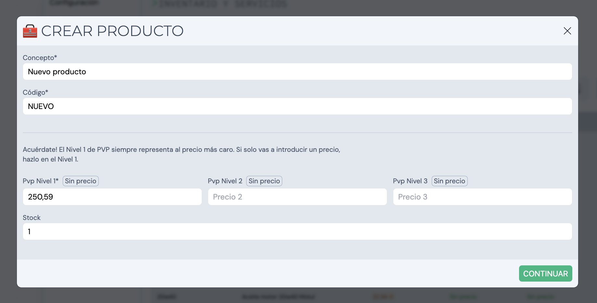
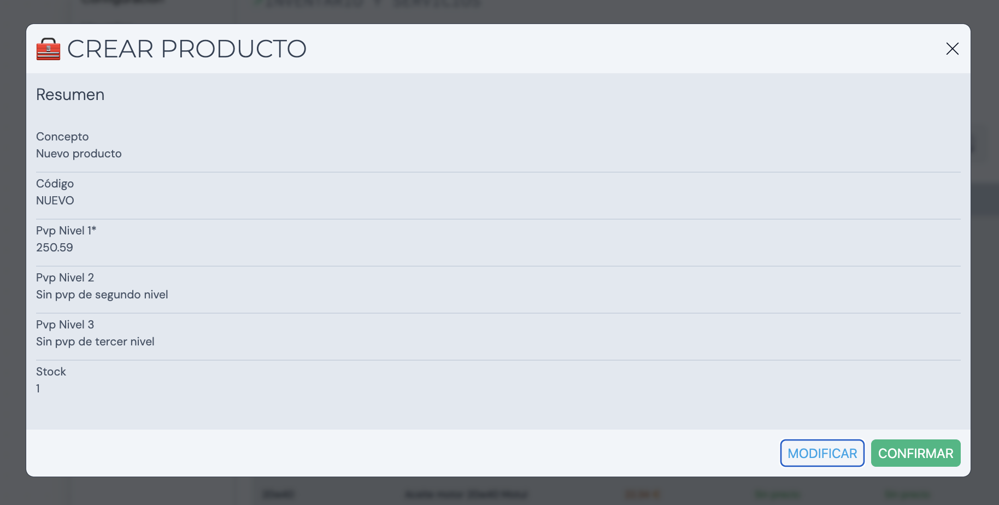
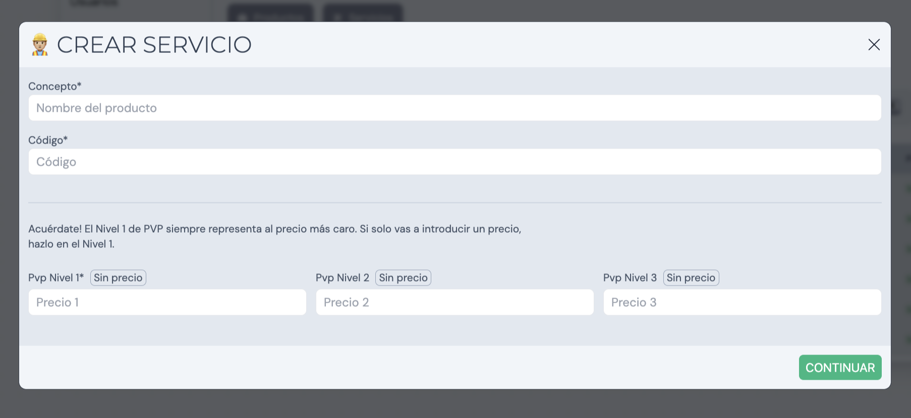

Al acceder a nuestro espacio personal en "Mi perfil", encontraremos una sección llamada **Inventario**. Aquí se almacenan los productos y servicios para después seleccionarlos en los documentos de facturación.

Podemos alternar entre productos y servicios haciendo click en los botones superiores.

## Añadir productos

Al hacer click en el botón _Añadir producto_ se abrirá un pop-up con el el formulario a rellenar para la creación del producto. Este formulario contiene las siguientes casillas:

- Concepto
- Código
- Pvp nivel 1*
- Pvp nivel 2
- Pvp nivel 3
- Stock

Una vez creado el producto automáticamente se añadirá al listado:

## Añadir servicios

Al igual que con los productos, los servicios funcionan y se crean de la misma manera. El formulario de creación contiene las siguientes casillas:

- Concepto
- Código
- Pvp nivel 1*
- Pvp nivel 2
- Pvp nivel 3

