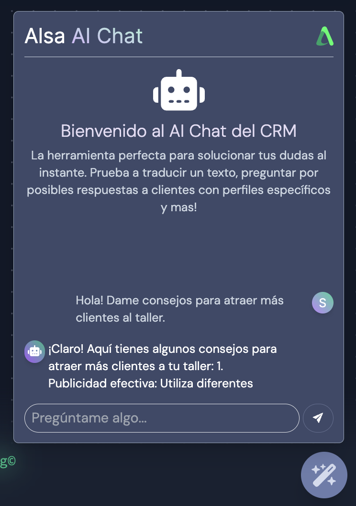
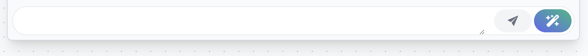
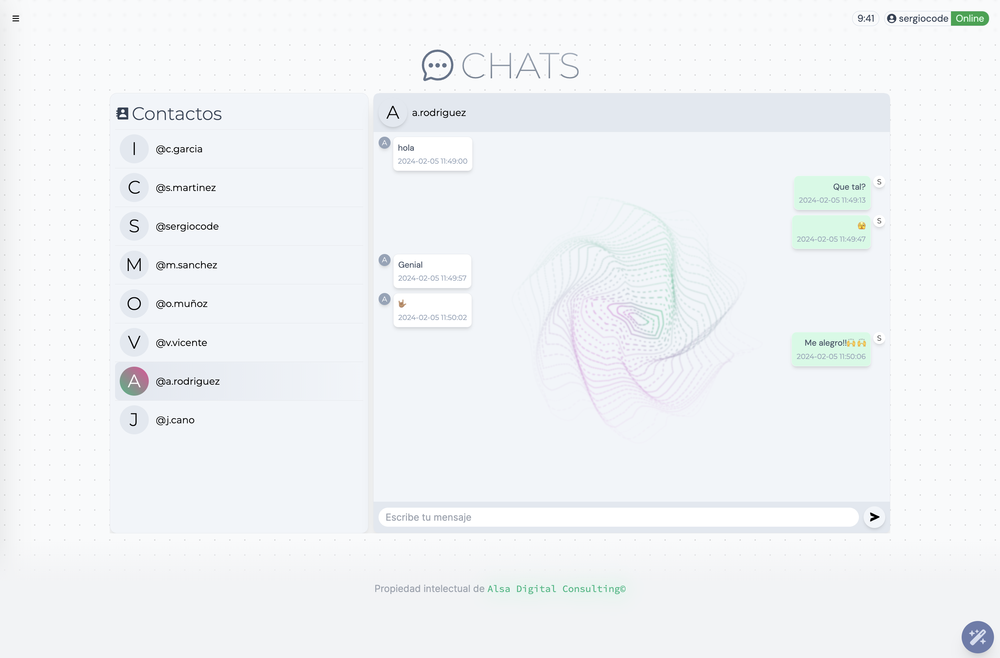
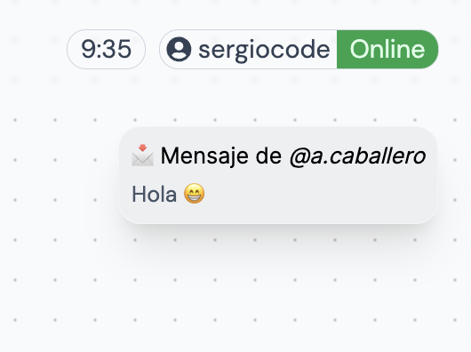

Explora las versiones del CRM de Alsa Digital Consulting. Descubre las novedades en cada actualización

## 1.0

### Alsa AI Chat

Consulta cualquier duda al AI Chat del CRM. Este chat funciona con inteligencia artifical y tiene fácil acceso desde cualquier parte del CRM. Para abrirlo simplemente tenemos que hacer click al botón circular situado en la zona inferior derecha del Dashboard.

Al hacer click abrirá un pequeño pop-up donde podemos comenzar la conversación.

### Generación de respuestas inteligentes

Genera respuestas inteligentes para los emails entrantes. Haciendo click al botón de la _Barita mágica 🪄_ el sistema generará una respuesta en base al último correo recibido por parte del cliente. Esta respuesta se puede modificar en el pop-up que se muestra al ejecutar la función. Una vez corregido el texto, podemos enviar el correo.

Podemos encontrar el acceso al chat en la Sidebar.

### Alterna entre consultas

Esta función nos permite cambiar de consulta sin tener que abandona la página. Al acceder al listado de consultas, automáticamente generamos un vector de consultas en ese mismo orden para concer la posición de la consulta seleccionada.

Al modificar datos o estados de las consultas, éstas cambiarán de posición al volver al listado. El vector de consultas se actualizará y volverán a ordenarse correctamente 🙌.

### Chat y contactos

Ahora podemos contactar con los usuarios internos de nuestro sistema, de forma que podemos prescindir de otros sistemas de mensajería instantanea, sin tener que abandonar la plataforma.

### Notificaciones temporales

Gracias a las notificaciones temporales podemos consultar de forma intuitiva el último mensaje recivido.

