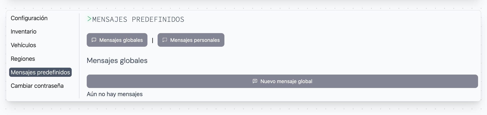
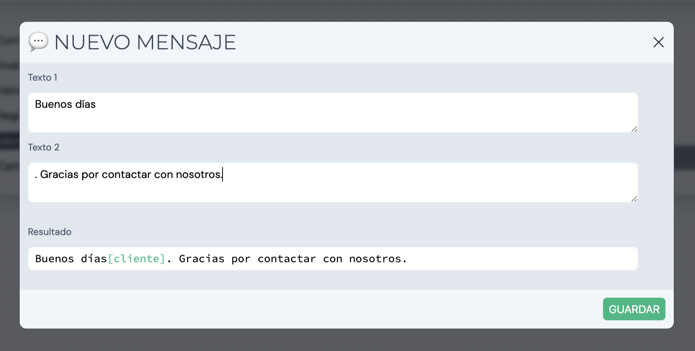
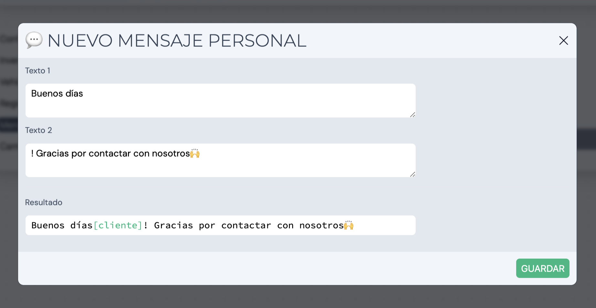

Al acceder a nuestro espacio personal en "Mi perfil", encontraremos una sección llamada **Mensajes predefinidos**. Esta característica ofrece la posibilidad de guardar mensajes predefinidos a modo de plantilla para responder consultas con más facilidad.

Los mensajes se pueden almacenar de forma individual (solo el creador del mensaje podrá hacer uso de este) y de forma global (todos los usuarios del sistema podrá hacer uso).

## Crear un mensaje global

Para crear un nuevo mensaje predefinido de forma global hay que hacer click en el botón _Nuevo mensaje global_. Al hacer click mostrará un pop-up con el cuadro de texto a rellenar:

Los campos a rellenar son los siguientes:

- Texto 1
- Texto 2

Estos textos se unirán con el nombre del cliente a la hora de responder con este mensaje (tal y como muestra la casilla resultado).

## Crear un mensaje personal

Para crear un nuevo mensaje predefinido de forma privada hay que hacer click en el botón _Nuevo mensaje personal_. Al hacer click mostrará un pop-up con el cuadro de texto a rellenar:

Los campos a rellenar son los siguientes:

- Texto 1
- Texto 2

Estos textos se unirán con el nombre del cliente a la hora de responder con este mensaje (tal y como muestra la casilla resultado).
