## General

Las órdenes de trabajo almacenan datos de un cliente junto a una serie de conceptos y servicios. Éstas se almacenan y pueden ser imprimidas en formato PDF una vez creadas.

## Crea una orden de trabajo

> ⚠️ Recuerda! Para crear una orden de trabajo tenemos que crear previamente una [entrada](/guia/entradas)

Para ello simplemente nos dirijimos a la página de la entrada que estemos trabajando y hacemos click en el botón _CREAR ORDEN DE TRABAJO_.

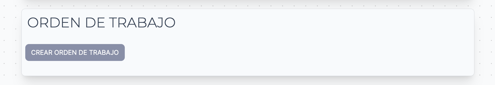

Automáticamente aparecerá la página de creación:

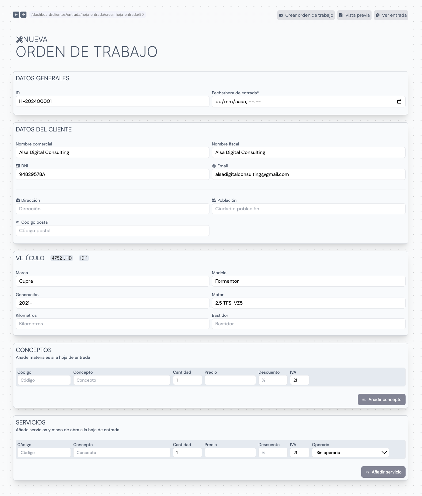

### Datos generales

Los datos generales de la órden de trabajo se resumen en el ID de la orden y la fecha y hora de entrada. El ID se genera automáticamente de forma que no haya colisión entre otros documentos. La estructura de este ID se basa en el año actual seguido del número de serie generado.

La fecha y hora de entrada se selecciona haciendo click en la casilla o en el icono de calendario. Veremos un pequeño calendario donde podemos seleccionar manualmente los datos. También está la opción de _Hoy_ para seleccionar automáticamente el dia y la fecha actual.

### Datos del cliente

Los datos del cliente se rellenan automáticamente. Podemos modificarlos según nos convenga. Si hay campos que no se han rellenado automáticamente se debe a que el cliente no tiene ese dato registrado en su perfil. Los datos del cliente son los siguientes:

- Nombre comercial
- Nombre fiscal
- DNI (o documento)
- Email
- Dirección
- Población
- Código postal

### Vehículo

En la sección de **Vehículo** tenemos los datos del vehículo asociado tanto a la Entrada como a la Orden de trabajo. Este apartado también se completará automáticamente con los datos obtenidos.
Es posible añadir manualmente el kilometraje y el número de bastidor

### Conceptos

#### Añadir concepto

Los conceptos y materiales de la orden de trabajo se añaden en la sección de _Conceptos_. Los campos disponibles para rellenar son los siguientes:

- Código
- Concepto
- Cantidad
- Precio
- Descuento (%)
- IVA
  - La casilla de IVA mostrará por defecto el IVA dependiendo de si el cliente figura como Regular o Intracomunitario. Podemos modificar manualmente el valor.

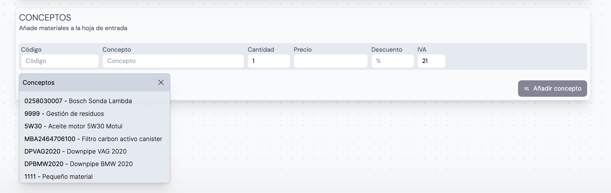

Al hacer click en la casilla _Código_ se abrirá una ventana flotante con el listado de Conceptos registrados en la base de datos. Para buscar uno tenemos que escribir y conforme se rellena, la ventana nos muestra los resultados que coinciden.

Al hacer click en uno de ellos se seleccionará y se completarán el resto de casillas con los datos guardados por defecto en nuestro Inventario de Conceptos. Podemos modificar manualmente los datos convenientes (Cantidad, Precio, etc)

Si no hay ningúna coincidencia en la búsqueda de conceptos podemos crear uno nuevo haciendo click al texto _Añadir concepto al inventario_

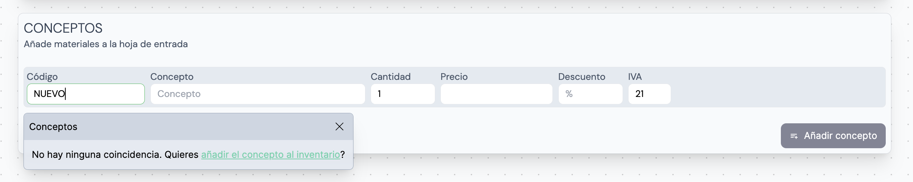

Se abrirá un pop-up con el formulario para registrar el nuevo concepto. Las casillas a rellenar son las siguientes:

- Concepto* ➡️ Nombre del concepto
- Código* ➡️ Código para referenciar al concepto
- Pvp Nivel 1*
- Pvp Nivel 2
- Pvp Nivel 3

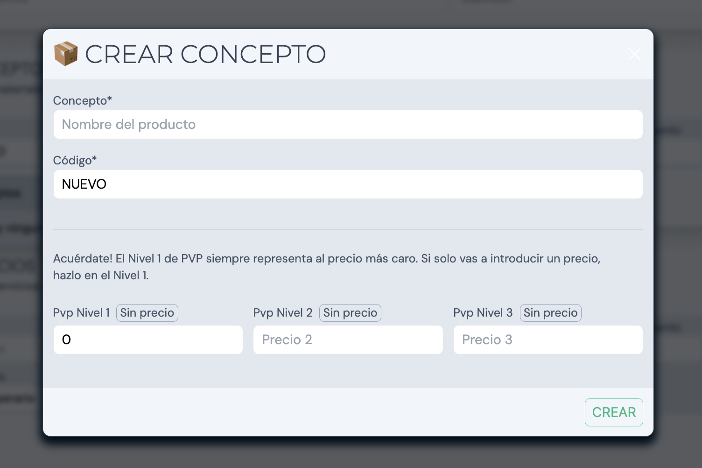

Al darle a crear automáticamente se guardará el concepto en el Inventario además de rellenar los campos del concepto que estábamos registrando préviamente en la orden de trabajo.

Una vez hayamos rellenado todos los campos tenemos que hacer click en el botón de la esquina inferior derecha _Añadir concepto_. Al hacer click el concepto se añadirá a la lista de conceptos.

#### Eliminar concepto

Si queremos eliminar un concepto nos dirigimos a él en el listado y hacemos click en la última castilla que corresponde con la columna _Eliminar_ 🗑️

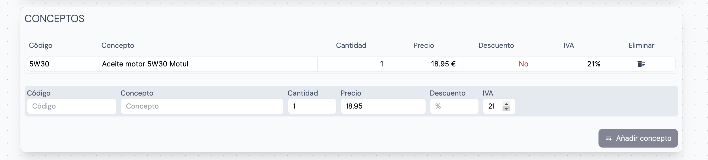

### Servicios

Los servicios de la orden de trabajo se añaden en la sección de _Servicios_. Los campos disponibles para rellenar son los siguientes:

- Código
- Concepto
- Cantidad
- Precio
- Descuento (%)
- IVA
  - La casilla de IVA mostrará por defecto el IVA dependiendo de si el cliente figura como Regular o Intracomunitario. Podemos modificar manualmente el valor.
- Operario
  - Selecciona un operario de la lista de contactos para asignarle las horas de trabajo.

El funcionamiento de los servicios es similar al de los conceptos a excepción de la casilla de _Operario_. Para añadir servicios registrados o no préviamente en el Inventario de servicios, realizamos el mismo proceso que en el apartado anterior _Añadir concepto_

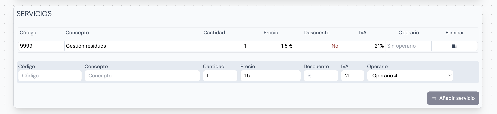

Una vez rellenados los campos hacemos click en el botón de la esquina inferior derecha _Añadir servicio_ para añadirlo a la lista.

## Finalizar la creación

Una vez terminemos de configurar los conceptos y servicios de la orden de trabajo, haremos click en el bóton fijo en el menú superior _Crear orden de trabajo_

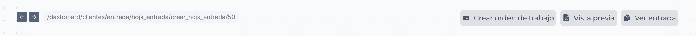

Cuando la orden se procese en la base de datos, automáticamente nos redirigirá a la página de la entrada, donde se mostrará la orden que hemos creado. Podemos observar que aún no hay fecha de finalización debido a que aún no se ha cobrado una factura relacionada con la entrada.

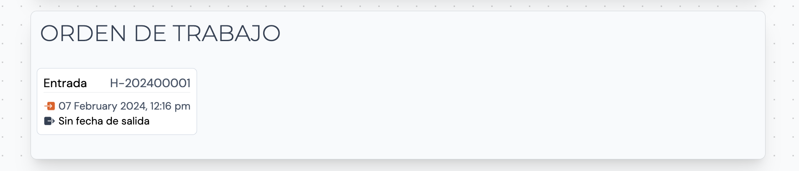

## Documento

Una vez generada la orden de trabajo podemos acceder a su página y ver el contenido de esta:

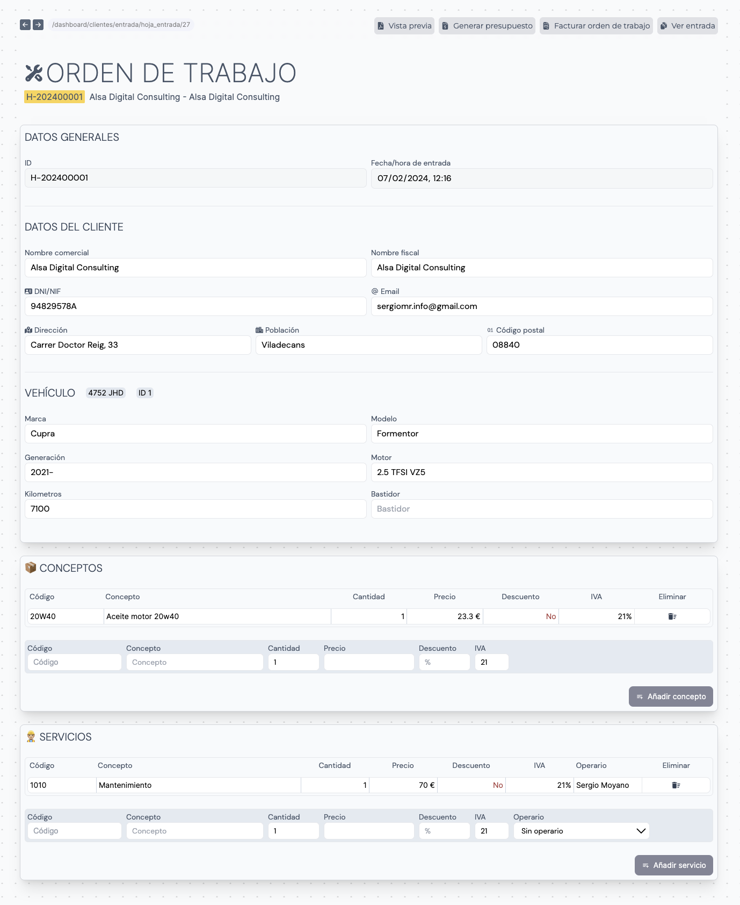

### Visualizar PDF

Hay 2 maneras de visualizar el PDF de la orden de trabajo.

1. Haz click en el botón _Vista previa_ de la parte superior derecha de la página. De esta manera abriremos un pop-up con el documento PDF.

    Para descargar el documento hacemos click en el botón ⬇️

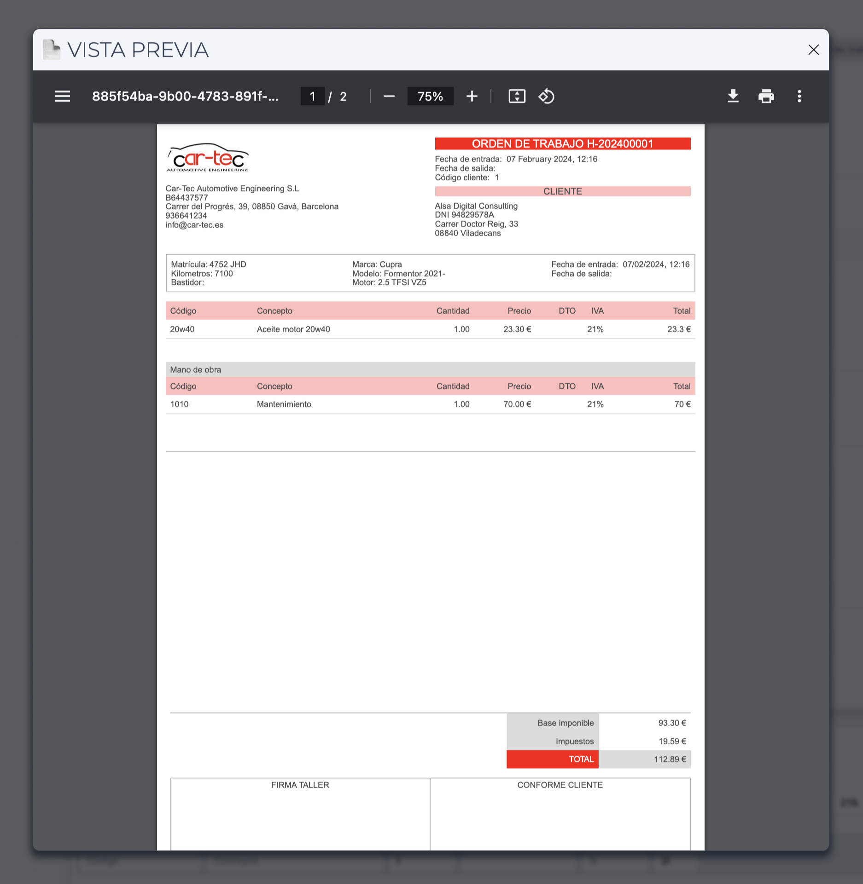

2. Desliza hacia la parte inferior de la página. Justo debajo de la sección de servicios tenemos un espacio

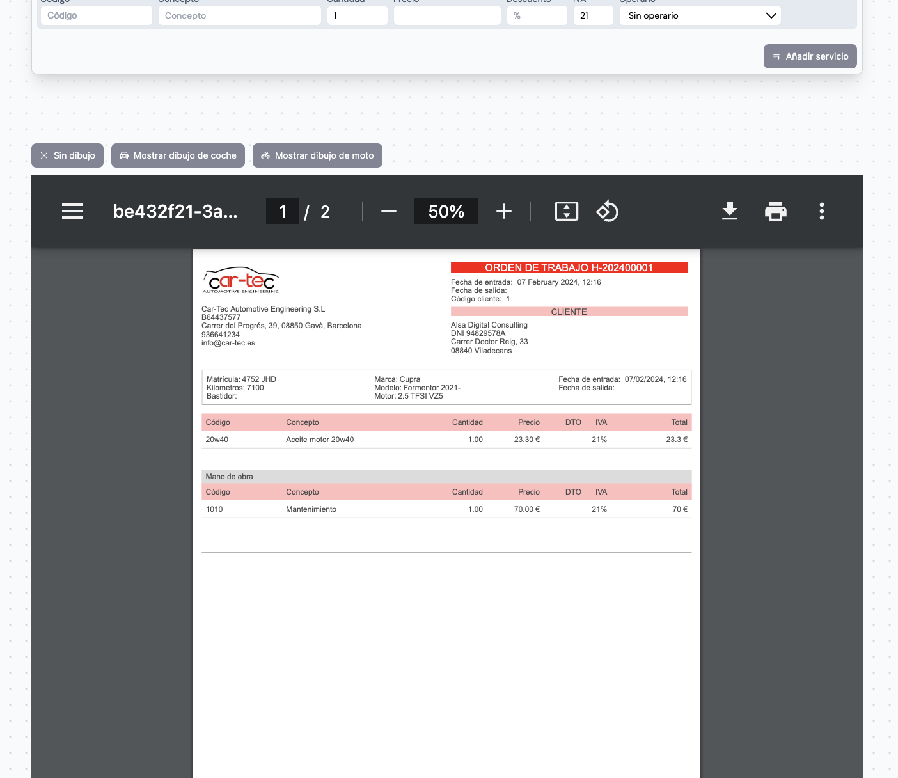

Si queremos mostrar un dibujo de referencia para imprimir la orden, podemos hacer click en los siguientes botones para mostrar uno u otro:

- Mostrar dibujo de coche
- Mostrar dibujo de moto

Esto puede ser útil para hacer anotaciones en papel 🙌📄

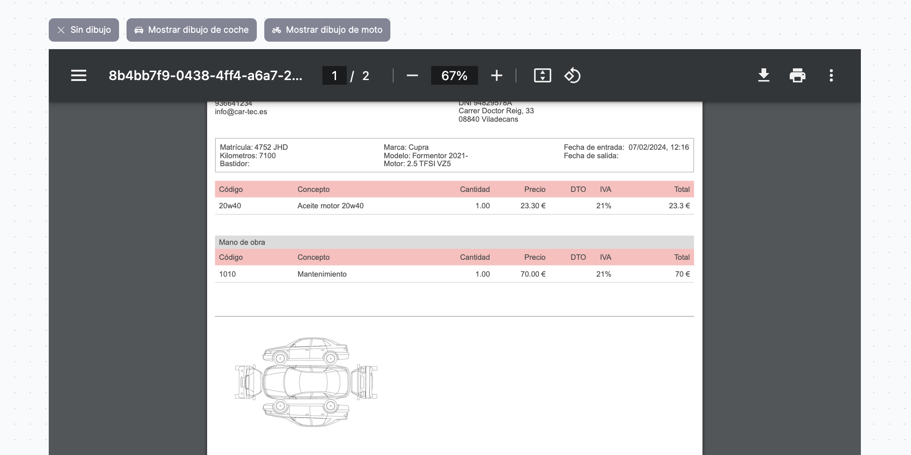

## Presupuestar orden de trabajo

Para generar un presupuesto en base a la orden de trabajo abierta nos dirigimos al menu superior hasta ubicar el botón _Generar presupuesto_. Esta acción abrira un pop-up donde escogeremos entre las siguientes opciones:

1. Generar presupuesto. Esta opción generará un presupuesto desde 0 con los conceptos y servicios de la Orden de trabajo abierta.
2. Ampliar presupuesto. Escoge un presupuesto existente a ampliar con los nuevos conceptos y servicios añadidos en la sesión.

## Facturar orden de trabajo

Si queremos facturar directamente la orden de trabajo actual nos dirigimos al menu superior hasta ubicar el botón _Facturar orden de trabajo_. Esta acción abrira un pop-up donde completaremos el siguiente formulario:

- Factura cobrada*. Marca la factura como cobrada o pendiente de cobro.

> ⚠️ Recuerda! Hasta que una factura no se cobre, la entrada permanecerá como _Activa_. En el momento que se marque como cobrada la entrada cambiará a _Finalizada_.

- Método de pago. Selecciona un método de pago en caso de cobrar la factura.

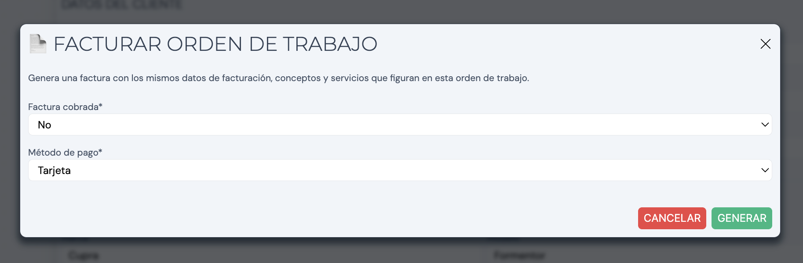
