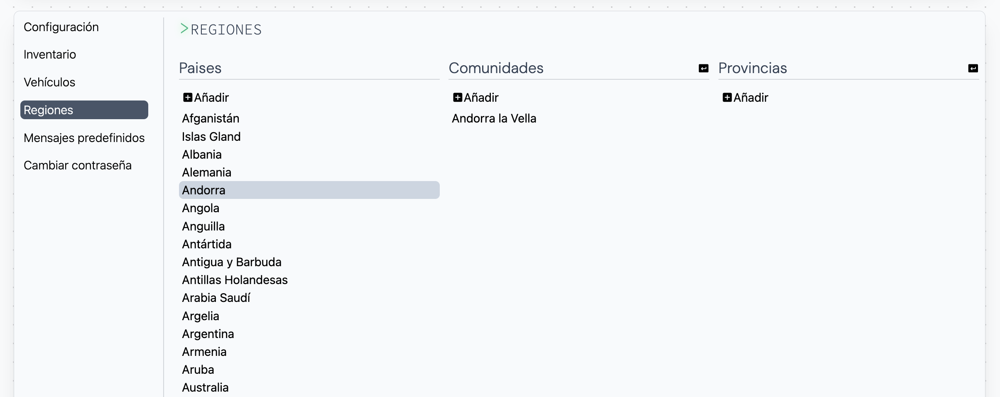
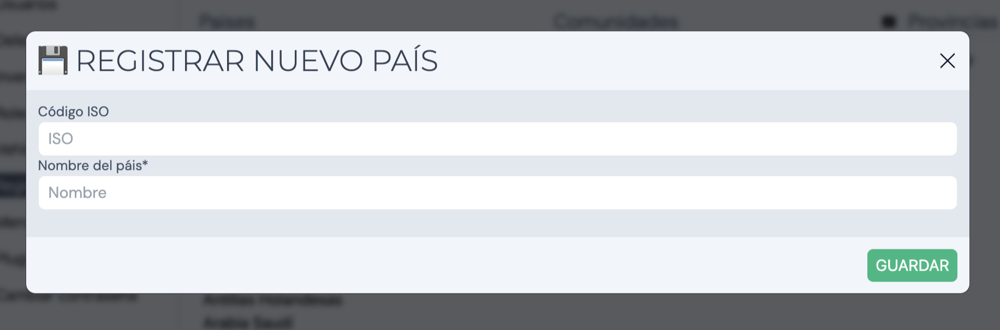
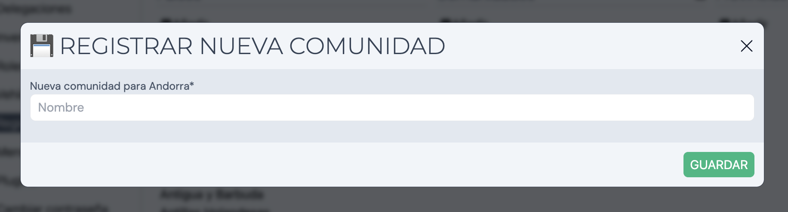
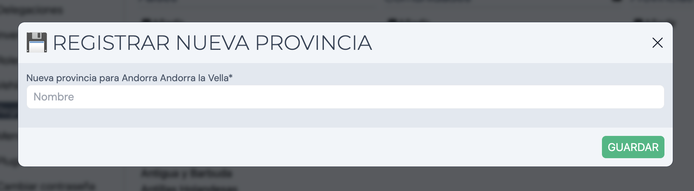

Al acceder a nuestro espacio personal en "Mi perfil", encontraremos una sección llamada **Regiones**. Esta sección muestra el listado de paises, comunidades y provincias disponibles para asignar a clientes.

## Añadir un país

Para añadir un nuevo país hay que ubicar la columna _Paises_ y el botón _Añadir_. Al hacer click mostrará un pop-up con el cuadro de texto a rellenar:

## Añadir una comunidad

Para añadir una nueva comunidad hay que seleccionar el país a la que queramos añadir la comunidad y posteriormente ubicar la columna _Comunidades_, junto al botón _Añadir_. Al hacer click mostrará un pop-up con el cuadro de texto a rellenar:

## Añadir una provincia

Para añadir una nueva provincia hay que seleccionar la comunidad a la que queramos añadir la provincia y posteriormente ubicar la columna _Provincias_, junto al botón _Añadir_. Al hacer click mostrará un pop-up con el cuadro de texto a rellenar:

