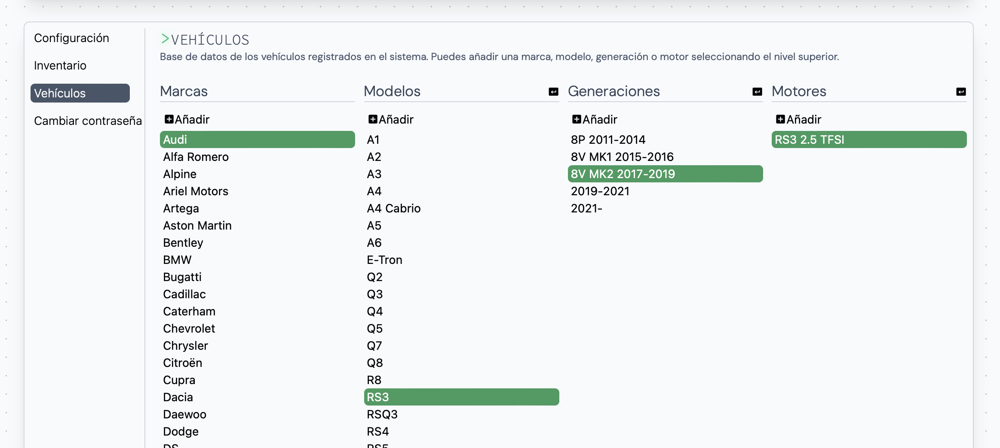
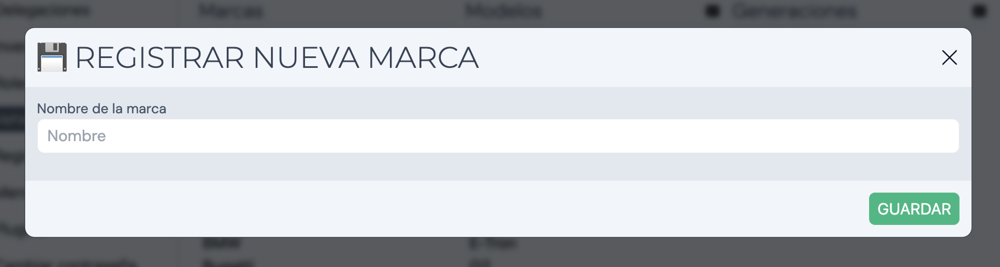
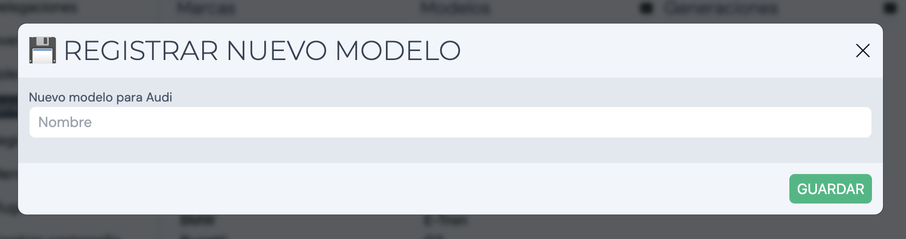
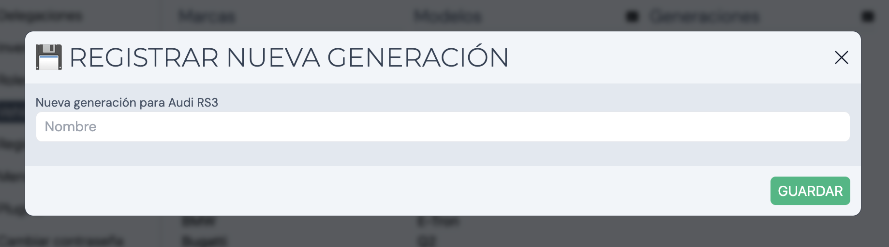
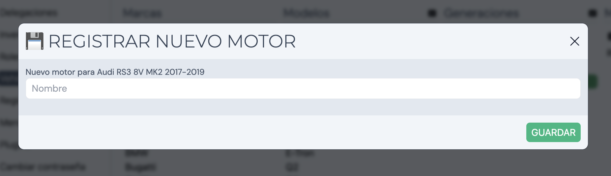

Al acceder a nuestro espacio personal en "Mi perfil", encontraremos una sección llamada **Vehículos**. Esta sección muestra el catálogo de marcas, modelos, generaciones y motores disponibles para asignar a clientes.

## Añadir una marca

Para añadir una nueva marca hay que ubicar la columna _Marcas_ y el botón _Añadir_. Al hacer click mostrará un pop-up con el cuadro de texto a rellenar:

## Añadir un modelo

Para añadir un nuevo modelo hay que seleccionar la marca a la que queramos añadir el modelo y posteriormente ubicar la columna _Modelos_ junto al botón _Añadir_. Al hacer click mostrará un pop-up con el cuadro de texto a rellenar:

## Añadir una generación

Para añadir una nueva generación hay que seleccionar el modelo al que queramos añadir la generación y posteriormente ubicar la columna _Generaciones_ junto al botón _Añadir_. Al hacer click mostrará un pop-up con el cuadro de texto a rellenar:

## Añadir un motor

Para añadir un nuevo motor hay que seleccionar la generación a la que queramos añadir el motor y posteriormente ubicar la columna _Motores_ junto al botón _Añadir_. Al hacer click mostrará un pop-up con el cuadro de texto a rellenar:

